# Biblioteca Arduino para o Si4735

Esta é uma biblioteca para o ambiente de desenvolvimento Arduino que implementa as funções do CI SI4735, BROADCAST AM / FM / SW RADIO RECEPTOR da Silicon Labs. Esta biblioteca tem o propósito de fornecer uma interface de programação mais amigável aos projetistas de rádios baseados no SI4735. __A comunicação usada por esta biblioteca é I2C__. Consulte as [Características desta Biblioteca](https://github.com/pu2clr/SI4735/blob/master/) para mais detalhes. 

Esta biblioteca foi construída com bases no [“__Si47XX PROGRAMMING GUIDE; AN332__”](https://www.silabs.com/documents/public/application-notes/AN332.pdf) (guia de programação da própria Silicon Labs). Portanto, ela poderá ser usada em todos os integrantes da família SI47XX, respeitando, é claro, as funcionalidades disponíveis para cada versão do CI. Essas funcionalidades podem ser conferidas na matriz de comparação exposta na tebela 1 (__Product Family Function__); páginas 2 e 3 do referido guia. 

Esta biblioteca pode ser livrimente copiada e distribuída. O modelo de licença utilizado é o do MIT, cujos termos podem ser lidos no documento [__license.txt__](./license.txt). 
[Copyright (c) 2019 Ricardo Lima Caratti](https://github.com/pu2clr/SI4735/blob/master/README-pt-BR.md#mit-licence)  

Contato: pu2clr@gmail.com

Há grupo de discussão no facebook denominado [__Si47XX para radioescutas__](https://www.facebook.com/groups/1121785218031286/) onde o propósito é trocar experiências com projetos baseados na família de CI SI47XX da Silicon Labs. Você será bem-vindo ao grupo [Si47XX para radioescuta](https://www.facebook.com/groups/1121785218031286/). 

<BR>

__Atenção__: 
* __Esta Biblioteca ainda está em desevolvimento. Portanto, algumas funções e comportamentos podem ser alterados ao longo do desenvolvimento__.
* __Esta documentação ainda está em construção e sujeita a alteração__. 
* __O SI4735 é um componente que opera com 3.3V. Se você não estiver usando uma versão do Arduino que opera com esta tensão, você deve usar alguma estratégia de conversão de tensão (incluindo os pinos digitais e analógicos) para trabalar corretamente com o SI4735__. 


## Sumário

1. [Licença MIT e Direito Autorais](https://github.com/pu2clr/SI4735/blob/master/README-pt-BR.md#licen%C3%A7a-e-direito-autorais)
2. [Agradecimentos](https://github.com/pu2clr/SI4735/blob/master/README-pt-BR.md#agradecimentos)
3. [Sua participação é importante](https://github.com/pu2clr/SI4735/blob/master/README-pt-BR.md#sua-participa%C3%A7%C3%A3o-%C3%A9-importante)
4. [Sobre o SI4735](https://github.com/pu2clr/SI4735/blob/master/README-pt-BR.md#sobre-o-si4735)
5. [Terminologia](https://github.com/pu2clr/SI4735/blob/master/README-pt-BR.md#terminologia)
6. [Características desta Biblioteca](https://github.com/pu2clr/SI4735/blob/master/README-pt-BR.md#caracter%C3%ADsticas-desta-biblioteca)
7. [Como instalar esta biblioteca](https://github.com/pu2clr/SI4735/blob/master/README-pt-BR.md#como-instalar-esta-biblioteca)
8. [Requisitos de hardware e configuração](https://github.com/pu2clr/SI4735/blob/master/README-pt-BR.md#requisitos-de-hardware-e-configura%C3%A7%C3%A3o)
   * [Esquema básico](https://github.com/pu2clr/SI4735/blob/master/README-pt-BR.md#esquema-b%C3%A1sico)
   * [Lista de componentes](https://github.com/pu2clr/SI4735/blob/master/README-pt-BR.md#lista-de-componentes)
   * [Fotos](https://github.com/pu2clr/SI4735/blob/master/README-pt-BR.md#fotos)
9.  [Documentação das funções da Biblioteca](https://github.com/pu2clr/SI4735/blob/master/README-pt-BR.md#documenta%C3%A7%C3%A3o-das-fun%C3%A7%C3%B5es-da-biblioteca)
10. [Referências](https://github.com/pu2clr/SI4735/blob/master/README-pt-BR.md#refer%C3%AAncias)
11. [Exemplos](https://github.com/pu2clr/SI4735/tree/master/examples)
12. [Vídeos](https://github.com/pu2clr/SI4735/blob/master/README-pt-BR.md#v%C3%ADdeos) 


## Licença e Direito Autorais

Copyright (c) 2019 Ricardo Lima Caratti

Esta biblioteca pode ser utilizada seguindo a licença de Software Livre do MIT, cujo texto traduzido de forma livre pode ser conferido a seguir:

A permissão é concedida, gratuitamente, a qualquer pessoa que obtenha uma cópia deste software e dos arquivos, incluindo a documentação, associados à esta biblioteca. É permitido usar, modificar, distribuir, juntar com outro software, publicar, fazer sublicença e negociar, sob as seguintes condições:

Os Direitos Autorais e as permissões supracitadas devem ser incluídos em todas as cópias ou partes copiadas desta biblioteca.

IMPORTANTE:

ESTA BIBLIOTECA É FORNECIDA "TAL COMO ESTÁ", SEM QUALQUER TIPO DE GARANTIA, EXPRESSA OU IMPLÍCITA. EM NENHUM CASO O AUTOR OU TITULAR DOS DIREITOS AUTORAIS SERÁ RESPONSÁVEL POR QUALQUER REIVINDICAÇÃO, DANOS OU OUTRA RESPONSABILIDADE.

<BR>
<BR>

## Agradecimentos

* Gostaria de agradecer ao Sr. Francisco Scaramella pelas sugestões e contribuições no campo da eletrônica bem como nos testes elaborados com esta biblioteca. 

* Gostaria de agradecer ao [Sr. Vadim Afonkin](https://youtu.be/fgjPGnTAVgM) por deixar disponível em seu [repositório de projetos](https://www.dropbox.com/sh/xzofrl8rfaaqh59/AAA5au2_CVdi50NBtt0IivyIa?dl=0) os arquivos de aplicação da atualização SSBRX para o Si4735. 


## Sua participação é importante

Se você tem interesse em fornecer suporte de desenvolvimento a esta biblioteca, junte-se a este projeto via Github. Se preferir, faça sugestões sobre funcionalidades que você gostaria que estivesse disponível nesta biblioteca.


## Sobre o SI4735 

O SI4735 é um rádio DSP encapsulado em um CI. Possui ótimo desempenho em AM (LW / MW / SW) e FM. O SI4735 pode ser programado usando envio de comandos e tratamento de respostas. Você pode controlá-lo por meio de um micro controlador como o Arduino. Para fazer o SI4735 executar uma ação, o micro controlador precisa enviar um conjunto de bytes (comando e argumentos) que o dispositivo interpreta,  executando o comando solicitado. Uma vez executado o comando, o Si4735 é capaz de fornecer uma sequência de bytes (respostas) que podem ser tratados pelo micro controlador.  


### Diagrama de Bloco do SI4735

A figura a seguir apresenta o diagrama de bloco do SI473X-D60. É importante observar o destaque em vermelhor inserido pelo autor desta biblioteca observando as tensões de trabalho da interface do SI4735. 


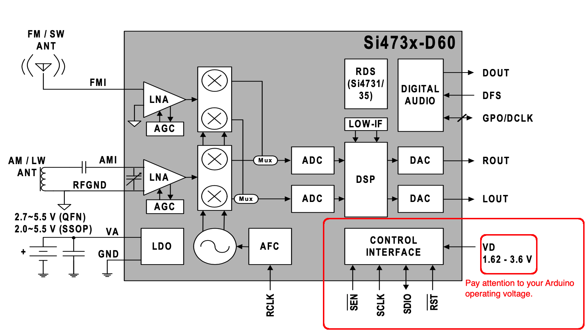

* Fonte: Silicon Labs Si4730/31/34/35-D60 / BROADCAST AM/FM/SW/LW RADIO RECEIVER (página 21)

<BR>
<BR>


### Principais características do Si4735

* FM - 64–108 MHz
* AM(MW) - 520–1710 kHz
* SW - A faixa de Frequência descrita no manual da Silicon Labs é 2.3–26.1 MHz. Na realidade, este CI vai mais longe que isso segundo testes realizados durante o desenvolvimento desta biblioteca. Contudo, é importante ressaltar que algumas características de recepção não foram avaliadas em frequências superiores à especificada pelo fabricante. Por exemplo, sensibilidade.   
* LW - 153–279 kHz
* Possibilita atualização de Firmware. Isso inclui a possibilidade de ajustes no CI para recepção em SSB.
* Advanced AM/FM seek tuning
* Controle Automático de Frequência (Automatic frequency control - AFC)
* Controle Automático de Ganho (Automatic gain control - AGC)
* AM/FM/SW/LW digital tuning
* RDS/RBDS
* Comunicação I2C e SPI. __Esta biblioteca faz uso somente do protocolo I2C__. 
* Excelente guia de programação provido pela Silicon Labs.

<BR>

## Terminologia

| Term | Description |
| ---- | ----- |
| API  | Application Programming Interface. Neste contexto, é um conjunto de rotinas e padrões estabelecidos por esta Biblioteca para simplificar a programação de programas para Arduino. Neste caso, a programação do SI4735| 
|Arduino Libraries|Neste contexto, "Libraries" (bibliotecas) são arquivos escritos em C or C++ (.c, .cpp) que podem ser utilizados em programas (sketches) Arduino. A biblioteca SI4735 para Arduino oferece facilidade de programação do SI4735 no ambiente Arduino | 
|IDE   |Integrated Development Environment (Ambiente Integrado de Desenvolvimento)|      
|Sketch| Nome comumente usado para referenciar um programa para Arduino|
|interrupt| Neste contexto, é um recurso de programação utilizado para tratar eventos disparados pelo micro controlador. 
|C++| É uma linguagem de programação orientada a objetos. Pode ser entendida como uma extensão da linguagem C que permite o desenvolvimento de programas e bibliotecas usando a abordagem Orientada a Objetos. |
|POC| Proof of Concept (Prova de Conceito) |
| SEN | Serial enable pin, active low; used as device select in 3-wire and SPI operation and address selection in 2-wire operation| 
| SDIO | Serial data in/data out pin|
| SCLK | Serial clock pin|
| RST  | Also RSTb—Reset pin, active low |
| RCLK | External reference clock |
| GPO | General purpose output |
| CTS | Clear to send |
| STC | Seek/Tune Complete |
| NVM | Non-volatile internal device memory |
| CMD | Command byte |
| COMMANDn | Command register (16-bit) in 3-Wire mode (n = 1 to 4) |
| ARGn | Argument byte (n = 1 to 7) | 
| STATUS | Status byte |
| RESP | Response byte (n = 1 to 15) |
| RESPONSEn | Response register (16-bit) in 3-Wire mode (n = 1 to 8)| 
| Soft Mute | É um recurso utilizado para atenuar os ruídos na saída de áudio quando a estação captada for muito fraca |
| Firmware Upgrades | O CI Si473x-D60 permite acomadar pequenos ajustes em seu firmware em sua memória RAM interna |

<BR>
<BR>

## Características desta Biblioteca

Esta biblioteca usa o protocolo de comunicação I2C e implementa a maioria das funções oferecidas pelo Si4735 (BROADCAST AM / FM / SW / LW RADIO RECEPTOR).

1. Open Source 
2. Totalmente baseada no [Si47XX PROGRAMMING GUIDE](https://www.silabs.com/documents/public/application-notes/AN332.pdf)
3. Programação Orientada a Objetos usando C++
4. Disponível no Ambiente de Desenvolvimento do Arduino
5. Simplifica projetos de rádios baseados no SI4735
6. Utiliza o protocolo de comunicação I2C
7. Suporte à SSB. 
8. Suporte à RDS.


## Como instalar esta biblioteca

É possível instalar esta biblioteca usando diferentes abordagens. Recomendo as descritas a seguir.


### Instalação via Arduino IDE

Este é o método mais fácil.


<BR>
<BR>

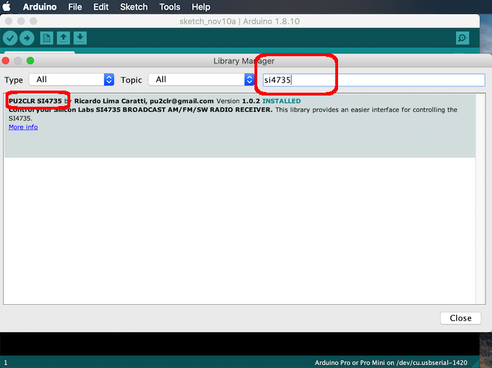

<BR>

### Instalação baixando os arquivos deste repositório


<BR>
<BR>

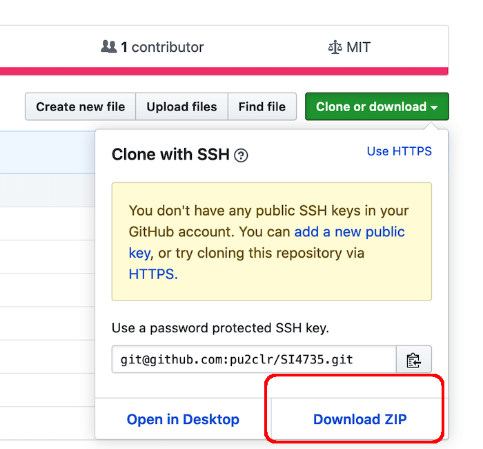

<BR>

Primeiro, você deve baixar esta biblioteca no formato zip. [CLique aqui para download](https://github.com/pu2clr/SI4735/archive/master.zip) to download.

Descompacte o arquivo SI4735.zip dentro da pasta Arduino Library. 

* On __Windows__: "My Documents\Arduino\libraries"
* On __MAC OS__: ˜/Documents/Arduino/libraries
* On __Linux__: ˜/Documents/Arduino/libraries


<BR>
<BR>


## Requisitos de hardware e configuração

Esta biblioteca foi escrita para a plataforma Arduino é foi testada com sucesso no Arduino Pro Mini (3.3V).


### Arduino 5V and Si4735

__Se você usar uma versão 5V do Arduino, UNO por exemplo, utilize alguma estarégia de conversão para conectaá-lo ao Si4735__. 


### Esquema básico

O propósito do protótipo a seguir é testar a Biblioteca Arduino para o SI4735 (objeto deste projeto). Por tanto, não se trata de um rádio com o propósito de atender as demandas de usuários exigentes. É possível, no entanto, adicionar novos componentes ao circuito com o objetivo de melhorar a sensibilidade de recepção bem como a sua saída de áudio. 

A imagem a seguir apresenta o esquema proposto pela Silicon Labs (denominado Application Schematic). Foi adicionado ao circuito, dois resistores “pull-up” ao barramento I2C e dois capacitores na saída de áudio. Esses adendos estão descritos com mais detalhes a seguir.  

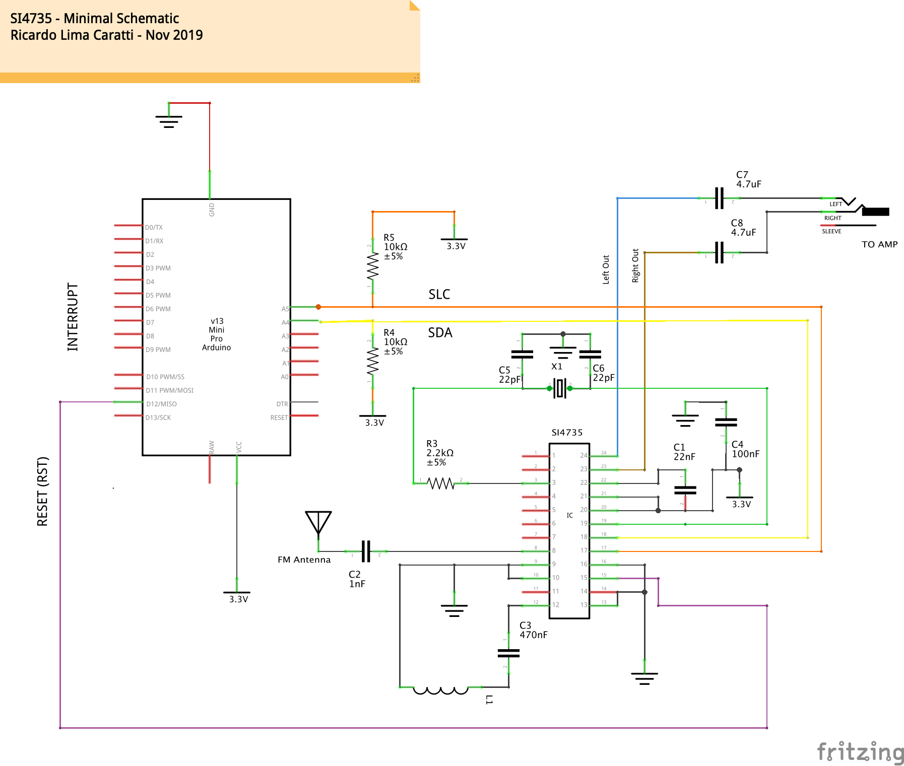


__MAIS UMA VEZ É IMPORTANTE RESSALTAR QUE O SI4735 OPERA COM TENSÕES INFERIORES A 5V. PORTANTO, NÃO O UTILIZE CONECTADO A UM ARDUINO DE 5V SEM UMA ESTRATÉGIA DE CONVERSÃO DE TENSÃO.__

<BR>
<BR>

#### The image bellow shows the Slicon Labs SSOP Typical Application Schematic.


<BR>
<BR>

### Lista de componentes

A tabela a seguir apresenta a lista de componentes utilizados para construir o protótipo do rádio baseado no SI4735. Observe os componentes adicionados ao circuito original proposto pela Silicon Labs. 


|Part	| Description |
|-------| ------------ |
| C1    | 22nF Monolithic Multilayer Chip Ceramic non polarized capacitor (Place it close to VA pin)|
| C2    | 100pF Monolithic Multilayer Chip Ceramic non polarized capacitor |
| C3    | 470nF Monolithic Multilayer Chip Ceramic non polarized capacitor| 
| C4    | 100nF Monolithic Multilayer Chip Ceramic non polarized capacitor (Place it close to VD pin)|
| C5 and C6 | 22pF (Crystal load capacitors) | 
| __C7 and C8[ˆ1]__ | 4.7uF Monolithic Multilayer Chip Ceramic non polarized capacitor | 
| R3    | 2.2K |
| __(R4 and R5)[ˆ2]__ | Entre 2K e 10K (pull-up resistors)  |
| L1 | Ferrite loop stick (about 500 μH) |
| X1    | 32.768 kHz crystal |
| SI4735 | CI CMOS que implementa um rádio AM(LW, MW and SW)/FM |

  * [ˆ1]: C7 and C8 são capacitores de cerâmica incluídos pelo autor deste projeto. O objetivo deles é retirar a componente de tensão continua na entrada do amplificador de áudio.  
  * [ˆ2]: R4 and R5 são resistores pull-up também incluídos pelo autor deste projeto. O objetivo deste resistores é atender aos requisitos recomendados pela especificação I2C. Procure usar um valor o mais baixo possível. Os valores para os resistores pull-up sugeridos aqui funcionam. Porém, poderá ser mais apropriado para o tipo de aplicação, resistências menores (por exemplo, 2K). Isso pode depender também de outros dispositivos conectados ao barramento I2C.


__Recomendações da Silicon Labs para serem consideradas durante a montagem do rádio__ 
__Veja "Silicon Labs Broadcast AM/FM/SW/LW Radio Receiver Documentation":
* Place C1 close to VA and C4 close to VD pin.
* All grounds connect directly to GND plane on PCB.
* Pins 6 and 7 are no connects, leave floating.
* Pins 10 and 11 are unused. Tie these pins to GND.
* To ensure proper operation and receiver performance, follow the guidelines in “AN383: Si47xx Antenna, Schematic,
* Layout, and Design Guidelines.” Silicon Laboratories will evaluate schematics and layouts for qualified customers.
* Pin 8 connects to the FM antenna interface, and pin 12 connects to the AM antenna interface.
* Place Si473x-D60 as close as possible to antenna and keep the FMI and AMI traces as short as possible.


## Fotos (Ferramentas e Acessórios) 


Este item apresenta algumas ferraentas e acessórios podem ser úteis em sua montagem do rádio baseado no SI4735.  


|Arduino Pro Mini|Arduino Pro Mini| 
|---------------|---------------|  
|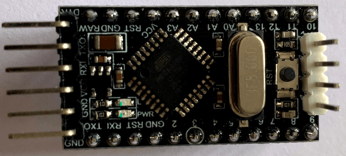|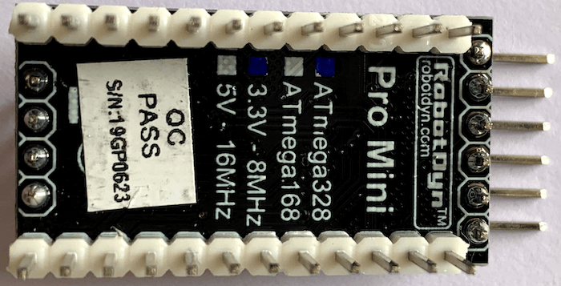|

* Pro Mini 3.3V 8MHz /5V 16M Atmega328 Replace ATmega128 Arduino Compatible Nano

<BR> 

| FT232 USB Adapter |FT232 USB Adapter| 
|---------------|---------------|   
|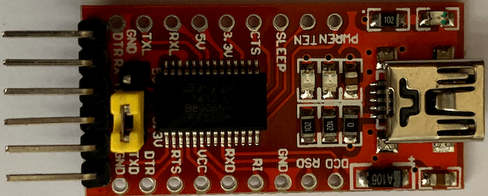|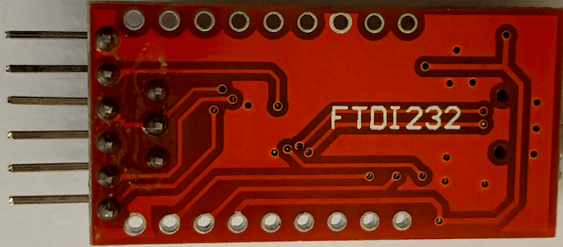|

* FT232RL 3.3V 5.5V FTDI USB to TTL Serial Adapter Module for Arduino Mini Port 


<BR>

|Magnifier|Solder| 
|---------------|---------------|   
|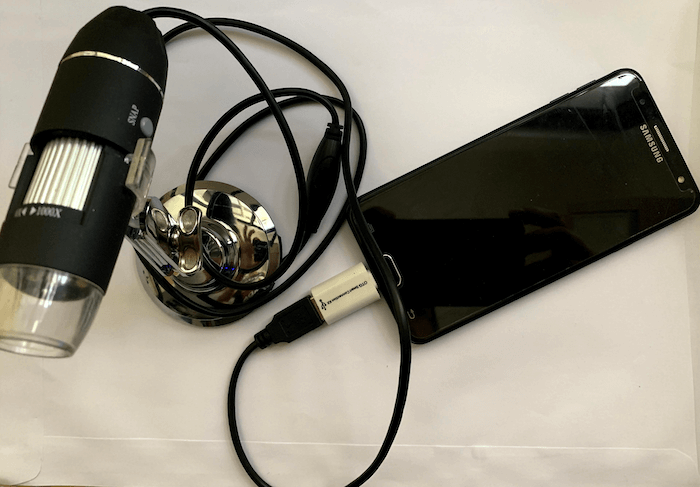|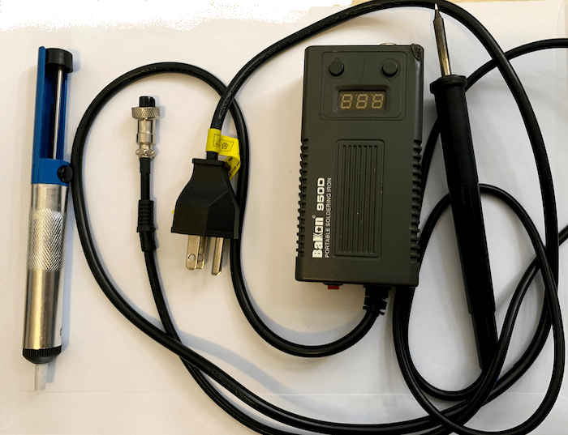|

* 50-1000X Magnifier Wireless WiFi Electric Microscope 2.0MP 8LED Endoscope Camera
* Soldering Iron Station with Temperature Control 

<BR>

|Adapter for SI4735|Soldering Accessories| 
|---------------|---------------|   
|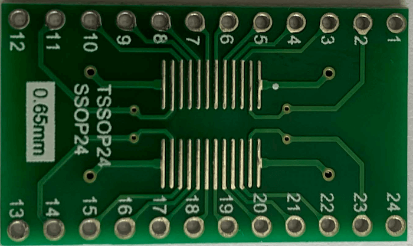|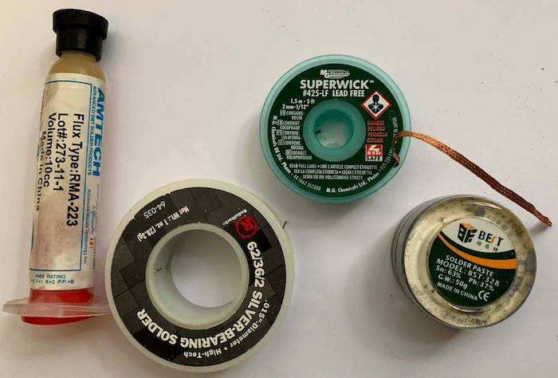|

* SO SOP SOIC SSOP TSSOP 24 Pin to DIP 24 Adapter PCB Board Converter
* 50g Soldering Paste Solder Flux Paste Cream for PCB PGA SMD BGA
* BGA SMD Soldering Paste Flux
  

<BR>

It was a bit hard to solder the kind of CI on adapter. However, by using a electronic magnifier it was possible.

### SI4735 soldered on adapter

|Si4735 on Adapter|Si4735 on Adapter| 
|---------------|---------------|  
|||

|Si4735 on Adapter|Si4735 on Adapter| 
|---------------|---------------|   
|||

### Soldagem do Si4735 no adaptador

|Si4735 on Adapter|Si4735 on Adapter| 
|---------------|---------------|  
|||

<BR> 
<BR>

|Si4735 on Adapter|Si4735 on Adapter| 
|---------------|---------------|   
|||


#### Protoboard

A montagem a seguir é baseada no circuito proposto pela Silicon Labs (__SSOP Typical Application Schematic__). 
Recomendo a leitura do manual "__Silicon Labs Documentation (Si4730/31/34/35-D60-BROADCAST AM/FM/SW/LW RADIO RECEIVER; page 19)__". Dois resistores pull-up de 10K foram adicionados ao barramento I2C. Note também que dois capacitores cerâmicos de 4.7uF foram adicionados à saída de audio do SI4735.  

Veja [C7 e C8 no esquema](https://github.com/pu2clr/SI4735/blob/master/README-pt-BR.md#schematic).


<BR>
<BR>


É importante destacar que o circuito montando em protoboard, sobretudo em soluções envolvendo RF,  pode não responder exatamente da forma esperada. Alguns ajustes podem ser necessários para deixar a montagem adequada às suas exigências. A circuito apresentado acima, inicialmente  respondeu bem em LW/MW, SW e FM. No entanto, nos experimentos com SSB, uma pequena interferência foi detectada.  O Sr. Francisco Scaramella, um colaborador deste projeto, inseriu alguns componentes no circuito e obteve excelentes resultados também em SSB em sua montagem com placa matricial e componentes soldados. A abordagem do Sr. Fracisco será inserida neste documento quando oportuno. 


## Documentação das funções da Biblioteca

Este item apresenta a lista de funções, métodos e estruturas de dados que podem ser úteis para a construção de seu programa (sketch) Arduino. 


### Índice de funções e métodos  

* [Defined Data Types and Structures](https://github.com/pu2clr/SI4735/blob/master/README-pt-BR.md#estrutura-e-tipos-de-dados-definidos)
* [__Métodos Públicos__](https://github.com/pu2clr/SI4735/blob/master/README-pt-BR.md#m%C3%A9todos-p%C3%BAblicos)
  * [setup](https://github.com/pu2clr/SI4735/blob/master/README-pt-BR.md#setup)
  * [setPowerUp](https://github.com/pu2clr/SI4735/blob/master/README-pt-BR.md#setpowerup)
  * [analogPowerUp](https://github.com/pu2clr/SI4735/blob/master/README-pt-BR.md#analogpowerup)
  * [powerDown]()
  * [setFrequency](https://github.com/pu2clr/SI4735/blob/master/README-pt-BR.md#setfrequency)
  * [frequencyUp](https://github.com/pu2clr/SI4735/blob/master/README-pt-BR.md#frequencyup)
  * [frequencyDown](https://github.com/pu2clr/SI4735/blob/master/README-pt-BR.md#frequencydown)
  * [setTuneFrequencyAntennaCapacitor](https://github.com/pu2clr/SI4735/blob/master/README-pt-BR.md#settunefrequencyantennacapacitor)
  * [setTuneFrequencyFast](https://github.com/pu2clr/SI4735/blob/master/README-pt-BR.md#settunefrequencyfast)
  * [setTuneFrequencyFreeze](https://github.com/pu2clr/SI4735/blob/master/README-pt-BR.md#settunefrequencyfreeze)
  * [isCurrentTuneFM](https://github.com/pu2clr/SI4735/blob/master/README-pt-BR.md#iscurrenttunefm)
  * [seekStation](https://github.com/pu2clr/SI4735/blob/master/README-pt-BR.md#seekstation)
  * [setAM](https://github.com/pu2clr/SI4735/blob/master/README-pt-BR.md#setam)
  * [setFM](https://github.com/pu2clr/SI4735/blob/master/README-pt-BR.md#setfm)
  * [setVolume](https://github.com/pu2clr/SI4735/blob/master/README-pt-BR.md#setvolume)
  * [getVolume](https://github.com/pu2clr/SI4735/blob/master/README-pt-BR.md#getvolume)
  * [volumeUp](https://github.com/pu2clr/SI4735/blob/master/README-pt-BR.md#volumeup)
  * [volumeDown](https://github.com/pu2clr/SI4735/blob/master/README-pt-BR.md#volumedown)
  * [getCurrentVolume](https://github.com/pu2clr/SI4735/blob/master/README-pt-BR.md#getcurrentvolume)
* [__FM Stereo and mono Control__](https://github.com/pu2clr/SI4735/blob/master/README-pt-BR.md#fm-stereo-and-mono-control)
  * [setFmBlendStereoThreshold](https://github.com/pu2clr/SI4735/blob/master/README-pt-BR.md#setfmblendstereothreshold)
  * [setFmBlendMonoThreshold](https://github.com/pu2clr/SI4735/blob/master/README-pt-BR.md#setfmblendmonothreshold)
  * [setFmBlendRssiStereoThreshold](https://github.com/pu2clr/SI4735/blob/master/README-pt-BR.md#setfmblendrssistereothreshold)
  * [setFmBLendRssiMonoThreshold](https://github.com/pu2clr/SI4735/blob/master/README-pt-BR.md#setfmblendrssimonothreshold)
  * [setFmBlendSnrStereoThreshold](https://github.com/pu2clr/SI4735/blob/master/README-pt-BR.md#setfmblendsnrstereothreshold)
  * [setFmBLendSnrMonoThreshold](https://github.com/pu2clr/SI4735/blob/master/README-pt-BR.md#setfmblendsnrmonothreshold)
  * [setFmBlendMultiPathStereoThreshold](https://github.com/pu2clr/SI4735/blob/master/README-pt-BR.md#setfmblendmultipathstereothreshold)
  * [setFmBlendMultiPathMonoThreshold](https://github.com/pu2clr/SI4735/blob/master/README-pt-BR.md#setfmblendmultipathmonothreshold)
* [__Si4735 current status__](https://github.com/pu2clr/SI4735/blob/master/README-pt-BR.md#si4735-current-status)
  * [getFrequency](https://github.com/pu2clr/SI4735/blob/master/README-pt-BR.md#getfrequency)
  * [getCurrentFrequency](https://github.com/pu2clr/SI4735/blob/master/README-pt-BR.md#getcurrentfrequency) 
  * [getStatus](https://github.com/pu2clr/SI4735/blob/master/README-pt-BR.md#getstatus)
  * [getTuneCompleteTriggered](https://github.com/pu2clr/SI4735/blob/master/README-pt-BR.md#gettunecompletetriggered)
  * [getSignalQualityInterrupt](https://github.com/pu2clr/SI4735/blob/master/README-pt-BR.md#getsignalqualityinterrupt)
  * [getRadioDataSystemInterrupt](getRadioDataSystemInterrupt)
  * [getStatusError](https://github.com/pu2clr/SI4735/blob/master/README-pt-BR.md#getstatuserror)
  * [getStatusCTS](https://github.com/pu2clr/SI4735/blob/master/README-pt-BR.md#getstatuscts)
  * [getACFIndicator](https://github.com/pu2clr/SI4735/blob/master/README-pt-BR.md#getacfindicator)
  * [getBandLimit](https://github.com/pu2clr/SI4735/blob/master/README-pt-BR.md#getbandlimit)
  * [getReceivedSignalStrengthIndicator](https://github.com/pu2clr/SI4735/blob/master/README-pt-BR.md#getreceivedsignalstrengthindicator)
  * [getStatusSNR](https://github.com/pu2clr/SI4735/blob/master/README-pt-BR.md#getstatussnr)
  * [getStatusMULT](https://github.com/pu2clr/SI4735/blob/master/README-pt-BR.md#getstatusmult)
  * [getAntennaTuningCapacitor](https://github.com/pu2clr/SI4735/blob/master/README-pt-BR.md#getantennatuningcapacitor)
  * [getStatusValid](https://github.com/pu2clr/SI4735/blob/master/README-pt-BR.md#getstatusvalid)
* [__SI4735 Received Signal Quality__](https://github.com/pu2clr/SI4735/blob/master/README-pt-BR.md#si4735-received-signal-quality)
  * [getCurrentReceivedSignalQuality](https://github.com/pu2clr/SI4735/blob/master/README-pt-BR.md#getcurrentreceivedsignalquality)
  * [getCurrentRSSI](https://github.com/pu2clr/SI4735/blob/master/README-pt-BR.md#getcurrentrssi)
  * [getCurrentSNR](https://github.com/pu2clr/SI4735/blob/master/README-pt-BR.md#getcurrentsnr)
  * [getCurrentRssiDetectLow](https://github.com/pu2clr/SI4735/blob/master/README-pt-BR.md#getcurrentrssidetectlow)
  * [getCurrentRssiDetectHigh](https://github.com/pu2clr/SI4735/blob/master/README-pt-BR.md#getcurrentrssidetecthigh)
  * [getCurrentSnrDetectLow](https://github.com/pu2clr/SI4735/blob/master/README-pt-BR.md#getcurrentsnrdetectlow)
  * [getCurrentSnrDetectHigh](https://github.com/pu2clr/SI4735/blob/master/README-pt-BR.md#getcurrentsnrdetecthigh)
  * [getCurrentValidChannel](https://github.com/pu2clr/SI4735/blob/master/README-pt-BR.md#getcurrentvalidchannel)
  * [getCurrentAfcRailIndicator](https://github.com/pu2clr/SI4735/blob/master/README-pt-BR.md#getcurrentafcrailindicator)
  * [getCurrentSoftMuteIndicator](https://github.com/pu2clr/SI4735/blob/master/README-pt-BR.md#getcurrentsoftmuteindicator)
  * [getCurrentStereoBlend](https://github.com/pu2clr/SI4735/blob/master/README-pt-BR.md#getcurrentstereoblend)
  * [getCurrentPilot](https://github.com/pu2clr/SI4735/blob/master/README-pt-BR.md#getcurrentpilot)
  * [getCurrentMultipath](https://github.com/pu2clr/SI4735/blob/master/README-pt-BR.md#getcurrentmultipath)
  * [getCurrentSignedFrequencyOffset](https://github.com/pu2clr/SI4735/blob/master/README-pt-BR.md#getcurrentsignedfrequencyoffset)
  * [getCurrentMultipathDetectLow](https://github.com/pu2clr/SI4735/blob/master/README-pt-BR.md#getcurrentmultipathdetectlow)
  * [getCurrentMultipathDetectHigh](https://github.com/pu2clr/SI4735/blob/master/README-pt-BR.md#getcurrentmultipathdetecthigh)
  * [getCurrentBlendDetectInterrupt](https://github.com/pu2clr/SI4735/blob/master/README-pt-BR.md#getcurrentblenddetectinterrupt)
* [__Current AGC Status__](https://github.com/pu2clr/SI4735/blob/master/README-pt-BR.md#current-agc-status)
  * [getAutomaticGainControl](https://github.com/pu2clr/SI4735/blob/master/README-pt-BR.md#getautomaticgaincontrol)
  * [isAgcEnabled](https://github.com/pu2clr/SI4735/blob/master/README-pt-BR.md#isagcenabled)
  * [getAgcGainIndex](https://github.com/pu2clr/SI4735/blob/master/README-pt-BR.md#getagcgainindex)
  * [setAutomaticGainControl](https://github.com/pu2clr/SI4735/blob/master/README-pt-BR.md#setautomaticgaincontrol)
* [__Filters__](https://github.com/pu2clr/SI4735/blob/master/README-pt-BR.md#filters)
  * [setBandwidth](https://github.com/pu2clr/SI4735/blob/master/README-pt-BR.md#setbandwidth) 
* [__SI4735 Firmware Information__](https://github.com/pu2clr/SI4735/blob/master/README-pt-BR.md#si4735-firmware-information)
  * [getFirmwarePN](https://github.com/pu2clr/SI4735/blob/master/README-pt-BR.md#getfirmwarepn)
  * [getFirmwareFWMAJOR](https://github.com/pu2clr/SI4735/blob/master/README-pt-BR.md#getfirmwarefwmajor)
  * [getFirmwareFWMINOR](https://github.com/pu2clr/SI4735/blob/master/README-pt-BR.md#getfirmwarefwminor)
  * [getFirmwarePATCHH](https://github.com/pu2clr/SI4735/blob/master/README-pt-BR.md#getfirmwarepatchh)
  * [getFirmwarePATCHL](https://github.com/pu2clr/SI4735/blob/master/README-pt-BR.md#getfirmwarepatchl)
  * [getFirmwareCMPMAJOR](https://github.com/pu2clr/SI4735/blob/master/README-pt-BR.md#getfirmwarecmpmajor)
  * [getFirmwareCMPMINOR](https://github.com/pu2clr/SI4735/blob/master/README-pt-BR.md#getfirmwarecmpminor)
  * [getFirmwareCHIPREV](https://github.com/pu2clr/SI4735/blob/master/README-pt-BR.md#getfirmwarechiprev)
* [__RDS__](https://github.com/pu2clr/SI4735/blob/master/README-pt-BR.md#rds)
  * [setRdsIntSource](https://github.com/pu2clr/SI4735/blob/master/README-pt-BR.md#setrdsintsource)
  * [setRdsConfig](https://github.com/pu2clr/SI4735/blob/master/README-pt-BR.md#setrdsconfig)
  * [getRdsStatus](https://github.com/pu2clr/SI4735/blob/master/README-pt-BR.md#getrdsstatus)
  * [getRdsReceived](https://github.com/pu2clr/SI4735/blob/master/README-pt-BR.md#getrdsreceived)
  * [getRdsSyncLost](https://github.com/pu2clr/SI4735/blob/master/README-pt-BR.md#getrdssynclost)
  * [getRdsSyncFound](https://github.com/pu2clr/SI4735/blob/master/README-pt-BR.md#getrdssyncfound)
  * [getRdsNewBlockA](https://github.com/pu2clr/SI4735/blob/master/README-pt-BR.md#getrdsnewblocka)
  * [getRdsNewBlockB](https://github.com/pu2clr/SI4735/blob/master/README-pt-BR.md#getrdsnewblockb)
  * [getRdsSync](https://github.com/pu2clr/SI4735/blob/master/README-pt-BR.md#getrdssync)
  * [getGroupLost](https://github.com/pu2clr/SI4735/blob/master/README-pt-BR.md#getgrouplost)
  * [getNumRdsFifoUsed](https://github.com/pu2clr/SI4735/blob/master/README-pt-BR.md#getnumrdsfifoused)
  * [getRdsPI](https://github.com/pu2clr/SI4735/blob/master/README-pt-BR.md#getrdspi)
  * [getRdsGroupType](https://github.com/pu2clr/SI4735/blob/master/README-pt-BR.md#getrdsgrouptype)
  * [getRdsVersionCode](https://github.com/pu2clr/SI4735/blob/master/README-pt-BR.md#getrdsversioncode)
  * [getRdsProgramType](https://github.com/pu2clr/SI4735/blob/master/README-pt-BR.md#getrdsprogramtype)
  * [getRdsText](https://github.com/pu2clr/SI4735/blob/master/README-pt-BR.md#getrdstext)
  * [getRdsTime](https://github.com/pu2clr/SI4735/blob/master/README-pt-BR.md#getrdstime)
* [__SI4735 e suporte à SSB (Single Side Band)__](https://github.com/pu2clr/SI4735/blob/master/README-pt-BR.md#single-side-band-ssb-support)
  * [SI4735 patch](https://github.com/pu2clr/SI4735/blob/master/README-pt-BR.md#si4735-patch-support-for-single-side-band)
  * [queryLibraryId](https://github.com/pu2clr/SI4735/blob/master/README-pt-BR.md#querylibraryid)
  * [patchPowerUp](https://github.com/pu2clr/SI4735/blob/master/README-pt-BR.md#patchpowerup)
  * [downloadPatch](https://github.com/pu2clr/SI4735/blob/master/README-pt-BR.md#downloadpatch)
  * [Single Side Band (SSB) Methods](https://github.com/pu2clr/SI4735/blob/master/README-pt-BR.md#single-side-band-ssb-methods) 
  * [setSSBBfo](https://github.com/pu2clr/SI4735/blob/master/README-pt-BR.md#setssbbfo)
  * [setSSBConfig](https://github.com/pu2clr/SI4735/blob/master/README-pt-BR.md#setssbconfig)
  * [setSSB](https://github.com/pu2clr/SI4735/blob/master/README-pt-BR.md#setssb)
  * [setSSBAudioBandwidth](https://github.com/pu2clr/SI4735/blob/master/README-pt-BR.md#setssbaudiobandwidth)
  * [setSBBSidebandCutoffFilter](https://github.com/pu2clr/SI4735/blob/master/README-pt-BR.md#setsbbsidebandcutofffilter)
  * [setSSBAvcDivider](https://github.com/pu2clr/SI4735/blob/master/README-pt-BR.md#setssbavcdivider)
  * [setSSBAvcDivider](https://github.com/pu2clr/SI4735/blob/master/README-pt-BR.md#setssbavcdivider)
  * [setSSBAutomaticVolumeControl](https://github.com/pu2clr/SI4735/blob/master/README-pt-BR.md#setssbautomaticvolumecontrol)
  * [setSSBSoftMute](https://github.com/pu2clr/SI4735/blob/master/README-pt-BR.md#setssbsoftmute)
  * [setSSBDspAfc](https://github.com/pu2clr/SI4735/blob/master/README-pt-BR.md#setssbdspafc)
  * [setSSBConfig](https://github.com/pu2clr/SI4735/blob/master/README-pt-BR.md#setssbconfig)
  * [setSSBBfo](https://github.com/pu2clr/SI4735/blob/master/README-pt-BR.md#setssbbfo)


### Estrutura e Tipos de dados definidos


To make the SI4735 device easier to deal, some defined data types were built to handle byte and bits responses.

```cpp
/*****************************************************************
 * SI473X data types 
 * These data types will be usefull to deal with SI473X 
 *****************************************************************/

/*
 * Power Up arguments data type 
 * See Si47XX PROGRAMMING GUIDE; AN332; pages 64 and 65
 */
    typedef union {
    struct
    {
        // ARG1
        byte FUNC : 4;    // Function (0 = FM Receive; 1–14 = Reserved; 15 = Query Library ID)
        byte XOSCEN : 1;  // Crystal Oscillator Enable (0 = crystal oscillator disabled; 1 = Use crystal oscillator and and OPMODE=ANALOG AUDIO) .
        byte PATCH : 1;   // Patch Enable (0 = Boot normally; 1 = Copy non-volatile memory to RAM).
        byte GPO2OEN : 1; // GPO2 Output Enable (0 = GPO2 output disabled; 1 = GPO2 output enabled).
        byte CTSIEN : 1;  // CTS Interrupt Enable (0 = CTS interrupt disabled; 1 = CTS interrupt enabled).
        // ARG2
        byte OPMODE; // Application Setting. See page 65
    } arg;
    byte raw[2]; // same arg memory position, so same content.
} si473x_powerup;

```

```cpp 
/*
 * Represents how the  frequency is stored in the si4735.
 * It helps to convert frequency in unsigned int to two bytes (FREQL and FREQH)  
 */
typedef union {
    struct
    {
        byte FREQL; // Tune Frequency High Byte.
        byte FREQH; // Tune Frequency Low Byte.
    } raw;
    unsigned value;
} si47x_frequency;

```

```cpp

/* 
 *  Represents searching for a valid frequency data type.
 */
typedef union {
    struct
    {
        byte RESERVED1 : 2;
        byte WRAP : 1;   // Determines whether the seek should Wrap = 1, or Halt = 0 when it hits the band limit.
        byte SEEKUP : 1; // Determines the direction of the search, either UP = 1, or DOWN = 0.
        byte RESERVED2 : 4;
    } arg;
    byte raw;
} si47x_seek;
```


```cpp
/*  
 * Response status command 
 * See Si47XX PROGRAMMING GUIDE; pages 73 and 
 */
typedef union {
    struct
    {
        // Status
        byte STCINT : 1; // Seek/Tune Complete Interrupt; 1 = Tune complete has been triggered.
        byte DUMMY1 : 1;
        byte RDSINT : 1; // Radio Data System (RDS) Interrup; 0 = interrupt has not been triggered.
        byte RSQINT : 1; // Received Signal Quality Interrupt; 0 = interrupt has not been triggered.
        byte DUMMY2 : 2;
        byte ERR : 1; // Error. 0 = No error 1 = Error
        byte CTS : 1; // Clear to Send.
        // RESP1
        byte VALID : 1; // Valid Channel
        byte AFCRL : 1; // AFC Rail Indicator
        byte DUMMY3 : 5;
        byte BLTF : 1; // Reports if a seek hit the band limit
        // RESP2
        byte READFREQH; // Read Frequency High Byte.
        // RESP3
        byte READFREQL; // Read Frequency Low Byte.
        // RESP4
        byte RSSI; // Received Signal Strength Indicator (dBμV)
        // RESP5
        byte SNR; // This byte contains the SNR metric when tune is complete (dB).
        // RESP6
        byte MULT; // Contains the multipath metric when tune is complete
        // RESP7
        byte READANTCAP; // Contains the current antenna tuning capacitor value
    } resp;
    byte raw[7];
} si47x_response_status;
```

```cpp
/*
 * Firmware Information
 */
typedef union {
    struct
    {
        // status ("RESP0")
        byte STCINT : 1;
        byte DUMMY1 : 1;
        byte RDSINT : 1;
        byte RSQINT : 1;
        byte DUMMY2 : 2;
        byte ERR : 1;
        byte CTS : 1;
        byte PN;       //  RESP1 - Final 2 digits of Part Number (HEX).
        byte FWMAJOR;  // RESP2 - Firmware Major Revision (ASCII).
        byte FWMINOR;  // RESP3 - Firmware Minor Revision (ASCII).
        byte PATCHH;   // RESP4 - Patch ID High Byte (HEX).
        byte PATCHL;   // RESP5 - Patch ID Low Byte (HEX).
        byte CMPMAJOR; // RESP6 - Component Major Revision (ASCII).
        byte CMPMINOR; // RESP7 - Component Minor Revision (ASCII).
        byte CHIPREV;  // RESP8 - Chip Revision (ASCII).
        // RESP9 to RESP15 not used
    } resp;
    byte raw[9];
} si47x_firmware_information;
```

```cpp
/*
 * Status of FM_TUNE_FREQ or FM_SEEK_START commands or 
 * Status of AM_TUNE_FREQ or AM_SEEK_START commands.
 * 
 * See Si47XX PROGRAMMING GUIDE; AN332; pages 73 and 139
 */
typedef union {
    struct
    {
        byte INTACK : 1; // If set, clears the seek/tune complete interrupt status indicator.
        byte CANCEL : 1; // If set, aborts a seek currently in progress.
        byte RESERVED2 : 6;
    } arg;
    byte raw;
} si47x_tune_status;
```

```cpp
/*
 * Property Data type (help to deal with SET_PROPERTY command on si473X)
 */
typedef union {
    struct
    {
        byte byteLow;
        byte byteHigh;
    } raw;
    unsigned value;
} si47x_property;
```

```cpp
/*
 ********************** RDS Data types *******************************
 */

/* 
 * Data type for status information about the received signal quality
 * FM_RSQ_STATUS and AM_RSQ_STATUS
 * See Si47XX PROGRAMMING GUIDE; AN332; pages 75 and 
 */
typedef union {
    struct
    {
        // status ("RESP0")
        byte STCINT : 1;
        byte DUMMY1 : 1;
        byte RDSINT : 1;
        byte RSQINT : 1;
        byte DUMMY2 : 2;
        byte ERR : 1;
        byte CTS : 1;
        // RESP1
        byte RSSIILINT : 1; // RSSI Detect Low.
        byte RSSIHINT : 1;  // RSSI Detect High.
        byte SNRLINT : 1;   // SNR Detect Low.
        byte SNRHINT : 1;   // SNR Detect High.
        byte MULTLINT : 1;  // Multipath Detect Low
        byte MULTHINT : 1;  // Multipath Detect High
        byte DUMMY3 : 1;
        byte BLENDINT : 1; // Blend Detect Interrupt.
        // RESP2
        byte VALID : 1; // Valid Channel.
        byte AFCRL : 1; // AFC Rail Indicator.
        byte DUMMY4 : 1;
        byte SMUTE : 1; // Soft Mute Indicator. Indicates soft mute is engaged.
        byte DUMMY5 : 4;
        // RESP3
        byte STBLEND : 7; // Indicates amount of stereo blend in% (100 = full stereo, 0 = full mono).
        byte PILOT : 1;   // Indicates stereo pilot presence.
        // RESP4 to RESP7
        byte RSSI;    // RESP4 - Contains the current receive signal strength (0–127 dBμV).
        byte SNR;     // RESP5 - Contains the current SNR metric (0–127 dB).
        byte MULT;    // RESP6 - Contains the current multipath metric. (0 = no multipath; 100 = full multipath)
        byte FREQOFF; // RESP7 - Signed frequency offset (kHz).
    } resp;
    byte raw[8];
} si47x_rqs_status;
```

```cpp
/*
 * FM_RDS_STATUS (0x24) command
 * Data type for command and response information 
 * See Si47XX PROGRAMMING GUIDE; AN332; pages 77 and 78
 */

// Command data type
typedef union {
    struct
    {
        byte INTACK : 1;     // Interrupt Acknowledge; 0 = RDSINT status preserved; 1 = Clears RDSINT.
        byte MTFIFO : 1;     // Empty FIFO; 0 = If FIFO not empty; 1 = Clear RDS Receive FIFO.
        byte STATUSONLY : 1; // Determines if data should be removed from the RDS FIFO.
        byte dummy : 5;
    } arg;
    byte raw;
} si47x_rds_command;

```cpp
// Response data type for current channel and reads an entry from the RDS FIFO.
typedef union {
    struct
    {
        // status ("RESP0")
        byte STCINT : 1;
        byte DUMMY1 : 1;
        byte RDSINT : 1;
        byte RSQINT : 1;
        byte DUMMY2 : 2;
        byte ERR : 1;
        byte CTS : 1;
        // RESP1
        byte RDSRECV : 1;      // RDS Received; 1 = FIFO filled to minimum number of groups set by RDSFIFOCNT.
        byte RDSSYNCLOST : 1;  // RDS Sync Lost; 1 = Lost RDS synchronization.
        byte RDSSYNCFOUND : 1; // RDS Sync Found; 1 = Found RDS synchronization.
        byte DUMMY3 : 1;
        byte RDSNEWBLOCKA : 1; // RDS New Block A; 1 = Valid Block A data has been received.
        byte RDSNEWBLOCKB : 1; // RDS New Block B; 1 = Valid Block B data has been received.
        byte DUMMY4 : 2;
        // RESP2
        byte RDSSYNC : 1; // RDS Sync; 1 = RDS currently synchronized.
        byte DUMMY5 : 1;
        byte GRPLOST : 1; // Group Lost; 1 = One or more RDS groups discarded due to FIFO overrun.
        byte DUMMY6 : 5;
        // RESP3 to RESP11
        byte RDSFIFOUSED; // RESP3 - RDS FIFO Used; Number of groups remaining in the RDS FIFO (0 if empty).
        byte BLOCKAH;     // RESP4 - RDS Block A; HIGH byte
        byte BLOCKAL;     // RESP5 - RDS Block A; LOW byte
        byte BLOCKBH;     // RESP6 - RDS Block B; HIGH byte
        byte BLOCKBL;     // RESP7 - RDS Block B; LOW byte
        byte BLOCKCH;     // RESP8 - RDS Block C; HIGH byte
        byte BLOCKCL;     // RESP9 - RDS Block C; LOW byte
        byte BLOCKDH;     // RESP10 - RDS Block D; HIGH byte
        byte BLOCKDL;     // RESP11 - RDS Block D; LOW byte
        // RESP12 - Blocks A to D Corrected Errors.
        // 0 = No errors;
        // 1 = 1–2 bit errors detected and corrected;
        // 2 = 3–5 bit errors detected and corrected.
        // 3 = Uncorrectable.
        byte BLED : 2;
        byte BLEC : 2;
        byte BLEB : 2;
        byte BLEA : 2;
    } resp;
    byte raw[13];
} si47x_rds_status;
```

```cpp
/*
 * FM_RDS_INT_SOURCE property data type
 * See Si47XX PROGRAMMING GUIDE; AN332; page 103
 */
typedef union {
    struct
    {
        byte RDSRECV : 1;      // If set, generate RDSINT when RDS FIFO has at least FM_RDS_INT_FIFO_COUNT entries.
        byte RDSSYNCLOST : 1;  // If set, generate RDSINT when RDS loses synchronization.
        byte RDSSYNCFOUND : 1; // f set, generate RDSINT when RDS gains synchronization.
        byte DUMMY1 : 1;       // Always write to 0.
        byte RDSNEWBLOCKA : 1; // If set, generate an interrupt when Block A data is found or subsequently changed
        byte RDSNEWBLOCKB : 1; // If set, generate an interrupt when Block B data is found or subsequently changed
        byte DUMMY2 : 10;      // Reserved - Always write to 0.
    } refined;
    byte raw[2];
} si47x_rds_int_source;
```

```cpp
/*
 * Data type for FM_RDS_CONFIG Property
 * 
 * IMPORTANT: all block errors must be less than or equal the associated block error threshold for the group 
 * to be stored in the RDS FIFO. 
 * 0 = No errors; 1 = 1–2 bit errors detected and corrected; 2 = 3–5 bit errors detected and corrected; 3 = Uncorrectable.
 * Recommended Block Error Threshold options:
 *  2,2,2,2 = No group stored if any errors are uncorrected.
 *  3,3,3,3 = Group stored regardless of errors.
 *  0,0,0,0 = No group stored containing corrected or uncorrected errors.
 *  3,2,3,3 = Group stored with corrected errors on B, regardless of errors on A, C, or D.
 *  
 */
typedef union {
    struct
    {
        byte RDSEN : 1; // 1 = RDS Processing Enable.
        byte DUMMY1 : 7;
        byte BLETHD : 2; // Block Error Threshold BLOCKD
        byte BLETHC : 2; // Block Error Threshold BLOCKC.
        byte BLETHB : 2; // Block Error Threshold BLOCKB.
        byte BLETHA : 2; // Block Error Threshold BLOCKA.
    } arg;
    byte raw[2];
} si47x_rds_config;
```

```cpp
/*
 * Block A data type
 */
typedef union {
    struct
    {
        unsigned pi;
    } refined;
    struct
    {
        byte lowValue;
        byte highValue; // Most Significant byte first
    } raw;
} si47x_rds_blocka;
```


```cpp
/*
 * Block B data type
 * More about Group Type Contents see: https://github.com/pu2clr/SI4735/tree/master/examples/SI4735_RDS
 * See also Si47XX PROGRAMMING GUIDE; AN332; pages 78 and 79
 */
typedef union {
    struct
    {
        byte content : 5;            // Depends on Group Type and Version codes.
        byte programType : 5;        // PTY (Program Type) code
        byte trafficProgramCode : 1; // 0 = No Traffic Alerts; 1 = Station gives Traffic Alerts
        byte versionCode : 1;        // 0=A; 1=B
        byte groupType : 4;          // Group Type code.

    } refined;
    struct
    {
        byte lowValue;
        byte highValue; // Most Significant Byte first
    } raw;
} si47x_rds_blockb;
```

```cpp
typedef union {
    struct
    {
        byte offset : 5;
        byte offset_sense : 1; //
        byte minute : 6;       //
        byte hour : 4;         //
        unsigned mjd;
    } refined;
    byte raw[4];
} si47x_rds_date_time;
```


```cpp
/* AGC data types
 * FM / AM and SSB structure to AGC
 * See Si47XX PROGRAMMING GUIDE; AN332; For FM page 80; for AM page 142
 * See AN332 REV 0.8 Universal Programming Guide Amendment for SI4735-D60 SSB and NBFM patches; page 18. 
 */
typedef union {
    struct {
        // status ("RESP0")
        byte STCINT : 1;
        byte DUMMY1 : 1;
        byte RDSINT : 1;   // Not used for AM/SSB
        byte RSQINT : 1;
        byte DUMMY2 : 2;
        byte ERR : 1;
        byte CTS : 1;
        // RESP1
        byte AGCDIS : 1; // This bit indicates if the AGC is enabled or disabled. 0 = AGC enabled; 1 = AGC disabled.
        byte DUMMY:7;
        // RESP2
        byte AGCIDX; // For FM (5 bits - READ_LNA_GAIN_INDEX - 0 = Minimum attenuation (max gain)). For AM (8 bits). This byte reports the current AGC gain index.
    } refined;
    byte raw[3];
} si47x_agc_status;
```


```cpp
/* 
 * If FM, Overrides AGC setting by disabling the AGC and forcing the LNA to have a certain gain that ranges between 0 
 * (minimum attenuation) and 26 (maximum attenuation).
 * If AM, overrides the AGC setting by disabling the AGC and forcing the gain index that ranges between 0
 * See Si47XX PROGRAMMING GUIDE; AN332; For FM page 81; for AM page 143
 */
typedef union {
    struct {
        // ARG1
        byte AGCDIS : 1; // if set to 1 indicates if the AGC is disabled. 0 = AGC enabled; 1 = AGC disabled.
        byte DUMMY : 7;
        // ARG2
        byte AGCIDX; // AGC Index; If AMAGCDIS = 1, this byte forces the AGC gain index; 0 = Minimum attenuation (max gain)
    } arg;
    byte raw[2];
} si47x_agc_overrride;
```


<BR>
<BR>
<BR>


## Métodos Públicos

Neste contexto, métodos podem ser entendidos como as funções implementadas para a classe SI4735. Métodos Públicos são as funções que podem ser utilizadas ou chamadas de dentro de um sketch Arduino.

Atualmente esta biblioteca possui mais de 70 funções que podem ser utilizadas para controlar ou alterar o comportamento do SI4735. É muito importante para o desenvolvedor conhecer previamente os métodos implementados nesta biblioteca para tirar o máximo proveito possível das funções do rádio que será construído. A pasta [examples]((https://github.com/pu2clr/SI4735/blob/master/examples/) possui vários exemplos que podem orientar o desenvolvedor na utilização desta biblioteca. 


<BR>


### setup

```cpp
/* 
 * Starts the Si473X device. 
 * 
 * @param byte resetPin Digital Arduino Pin used to RESET command 
 * @param byte interruptPin interrupt Arduino Pin (see your Arduino pinout). If less than 0, iterrupt disabled
 * @param byte defaultFunction
 */
void SI4735::setup(byte resetPin, byte interruptPin, byte defaultFunction)
```

#### If you are not using interrupt use the __setup__ method as shown below.

```cpp
/* 
 * Starts the Si473X device.  
 * Use this setup if you are not using interrupt resource
 * 
 * @param byte resetPin Digital Arduino Pin used to RESET command 
 * @param byte defaultFunction
 */
void SI4735::setup(byte resetPin, byte defaultFunction)
```


#### Example of using setup

```cpp

#include <SI4735.h>

#define INTERRUPT_PIN 2
#define RESET_PIN 12

SI4735 si4735;

void setup()
{
    si4735.setup(RESET_PIN, INTERRUPT_PIN, FM_FUNCTION);
}
```

[See full example](https://github.com/pu2clr/SI4735/blob/master/examples/SI4735_POC/SI4735_POC.ino)


### setPowerUp

```cpp
/*
 * Set the Power Up parameters for si473X. 
 * Use this method to chenge the defaul behavior of the Si473X. Use it before PowerUp()
 * See Si47XX PROGRAMMING GUIDE; AN332; pages 65 and 129
 * @param byte CTSIEN sets Interrupt anabled or disabled (1 = anabled and 0 = disabled )
 * @param byte GPO2OEN sets GP02 Si473X pin enabled (1 = anabled and 0 = disabled )
 * @param byte PATCH  Used for firmware patch updates. Use it always 0 here. 
 * @param byte XOSCEN byte XOSCEN set external Crystal enabled or disabled 
 * @param byte FUNC sets the receiver function have to be used [0 = FM Receive; 1 = AM (LW/MW/SW) and SSB (if SSB patch apllied)]
 * @param byte OPMODE set the kind of audio mode you want to use.
 */
void SI4735::setPowerUp(byte CTSIEN, byte GPO2OEN, byte PATCH, byte XOSCEN, byte FUNC, byte OPMODE)
```

### analogPowerUp


```cpp
/*
 * Powerup in Analog Mode
 * You have to call setPowerUp before call analogPowerUp. 
 * Use setPowerUp to select FM, AM or SSB (if SSB patch apllied) mode.
 */
void SI4735::analogPowerUp(void) 
```

#### Example of using analogPowerUp

```cpp 
    // Set the initial SI473X behavior
    // CTSIEN   1 -> Interrupt anabled;
    // GPO2OEN  1 -> GPO2 Output Enable;
    // PATCH    0 -> Boot normally;
    // XOSCEN   1 -> Use external crystal oscillator;
    // FUNC     defaultFunction = 0 = FM Receive; 1 = AM (LW/MW/SW) Receiver.
    // OPMODE   SI473X_ANALOG_AUDIO = 00000101 = Analog audio outputs (LOUT/ROUT).

    setPowerUp(1, 1, 0, 1, defaultFunction, SI473X_ANALOG_AUDIO);
    analogPowerUp();
```    

### powerDown

```cpp
/* 
 * Moves the device from powerup to powerdown mode.
 * After Power Down command, only the Power Up command is accepted.
 */
void SI4735::powerDown(void)
```


### setFrequency

```cpp
/*
 * Set the frequency to the corrent function of the Si4735 (AM or FM)
 * You have to call setup or setPowerUp before call setFrequency.
 * 
 * @param unsigned freq Is the frequency to change. For example, FM => 10390 = 103.9 MHz; AM => 810 = 810 KHz. 
 */
void SI4735::setFrequency(unsigned freq) 
```

#### Example of using setFrequency

```cpp
    si4735.setFM(); 
    si4735.setFrequency(fm_freq); 
    showStatus(fm_freq,"MHz");
```    

[See full example](https://github.com/pu2clr/SI4735/blob/master/examples/SI4735_POC/SI4735_POC.ino)


### frequencyUp
```cpp
/*
 *  Increments the current frequency on current band/function by using the current step.
 *  See setFrequencyStep
 */ 
void SI4735::frequencyUp()
```


### frequencyDown
```cpp
/*
 *  Decrements the current frequency on current band/function by using the current step.
 *  See setFrequencyStep
 */ 
void SI4735::frequencyDown()
```


### setTuneFrequencyAntennaCapacitor

```cpp
/*
 * Selects the tuning capacitor value.
 * For FM, Antenna Tuning Capacitor is valid only when using TXO/LPI pin as the antenna input.
 * See Si47XX PROGRAMMING GUIDE; AN332; pages 71 and 136
 * 
 * @param capacitor If zero, the tuning capacitor value is selected automatically. 
 *                  If the value is set to anything other than 0:
 *                  AM - the tuning capacitance is manually set as 95 fF x ANTCAP + 7 pF. ANTCAP manual range is 1–6143;
 *                  FM - the valid range is 0 to 191.    
 *                  According to Silicon Labs, automatic capacitor tuning is recommended (value 0). 
 */
void SI4735::setTuneFrequencyAntennaCapacitor(unsigned capacitor)
```


### setTuneFrequencyFast

```cpp
/*
 * If set, executes fast and invalidated tune. The tune status will not be accurate
 * @param FAST if 1 executes fast and invalidated tune. Defult value is 0.
 */
inline void setTuneFrequencyFast(byte FAST) 
```

### setTuneFrequencyFreeze

```cpp
/*
 * Freeze Metrics During Alternate Frequency Jump. Only used on FM. 
 */ 
inline void setTuneFrequencyFreeze(byte FREEZE) 
```


### seekStation
```cpp
/*
 * Look for a station 
 * See Si47XX PROGRAMMING GUIDE; AN332; page 72
 * 
 * @param SEEKUP Seek Up/Down. Determines the direction of the search, either UP = 1, or DOWN = 0. 
 * @param Wrap/Halt. Determines whether the seek should Wrap = 1, or Halt = 0 when it hits the band limit.
 */
void SI4735::seekStation(byte SEEKUP, byte WRAP)
```

#### Example of using seekStation

```cpp
    si4735.seekStation(1,1);
```

#### seekStationUp and seekStationDown

```cpp
/*
 * Search for the next station 
 */
void SI4735::seekStationUp() 

/*
 * Search the previous station
 */
void SI4735::seekStationDown()
```

[See full example](https://github.com/pu2clr/SI4735/blob/master/examples/SI4735_POC/SI4735_POC.ino)


### setAM

```cpp
/*
 * Set the radio to AM function. It means: LW, MW and SW.
 */ 
void SI4735::setAM()
```

##### You can also use __setAM__ with parameters as shown below

```cpp
/*
 * Set the radio to AM (LW/MW/SW) function. 
 * 
 * @param fromFreq minimum frequency for the band
 * @param toFreq maximum frequency for the band
 * @param initialFreq initial frequency 
 * @param step step used to go to the next channel   
 */
void SI4735::setAM(unsigned fromFreq, unsigned toFreq, unsigned initialFreq, byte step)
```


### setFM

```cpp
/*
 * Set the radio to FM function
 */
void SI4735::setFM()
```

##### You can also use __setFM__ with parameters as shown below

```cpp
/*
 * Set the radio to FM function. 
 * 
 * @param fromFreq minimum frequency for the band
 * @param toFreq maximum frequency for the band
 * @param initialFreq initial frequency (default frequency)
 * @param step step used to go to the next channel   
 */
void SI4735::setFM(unsigned fromFreq, unsigned toFreq, unsigned initialFreq, byte step)
```


#### Example of using setAM() and setFM()

```cpp
    switch (key)
    {
    case 'A':
      si4735.setAM();
      si4735.setFrequency(am_freq);
      break;
    case 'F':
      si4735.setFM();
      si4735.setFrequency(fm_freq);
      break;
      .
      .
      .
```

[See full example](https://github.com/pu2clr/SI4735/blob/master/examples/SI4735_POC/SI4735_POC.ino)


#### isCurrentTuneFM

```cpp 
/*
 * Returns true if the radio is running FM (FM_TUNE_FREQ).
 */ 
bool SI4735::isCurrentTuneFM()
```


### setVolume

```cpp
/* 
 * Set the volume level
 * @param byte volume (domain: 0 - 63) 
 */
void SI4735::setVolume(byte volume)
```

#### Example of using setVolume()

```cpp
  si4735.setVolume(45);
```

[See full example](https://github.com/pu2clr/SI4735/blob/master/examples/SI4735_POC/SI4735_POC.ino)


### volumeUp

```cpp
/*
 *  Set sound volume level Up   
 */
void SI4735::volumeUp()
```


### volumeDown
```cpp
/*
 *  Set sound volume level Down   
 */
void SI4735::volumeDown()
```

#### Example of using volumeUp() and volumeDown()

```cpp
    switch (key)
    {
    case '+':
        si4735.volumeUp();
        break;
    case '-': 
        si4735.volumeDown();
        break;
    .
    .
    .    
```

[See full example](https://github.com/pu2clr/SI4735/blob/master/examples/SI4735_POC/SI4735_POC.ino)


### getCurrentVolume

```cpp 
/*
 * Returns the current volume level
 */ 
inline byte SI4735::getCurrentVolume() 
```

<BR>
<BR>

### FM Stereo and Mono Control

Methods to control the Stereo and Mono behaviour of the SI47XX.    

#### setFmBlendStereoThreshold
```cpp
/*
 * Sets RSSI threshold for stereo blend (Full stereo above threshold, blend below threshold). 
 * To force stereo, set this to 0. To force mono, set this to 127.
 * See Si47XX PROGRAMMING GUIDE; AN332; page 90. 
 */
void SI4735::setFmBlendStereoThreshold(uint8_t parameter)
```

#### setFmBlendMonoThreshold

```cpp
/*
 * Sets RSSI threshold for mono blend (Full mono below threshold, blend above threshold). 
 * To force stereo set this to 0. To force mono set this to 127. Default value is 30 dBμV.
 *  See Si47XX PROGRAMMING GUIDE; AN332; page 56.
 */
void SI4735::setFmBlendMonoThreshold(uint8_t parameter)
```

#### setFmBlendRssiStereoThreshold
```cpp
/* 
 * Sets RSSI threshold for stereo blend. (Full stereo above threshold, blend below threshold.) 
 * To force stereo, set this to 0. To force mono, set this to 127. Default value is 49 dBμV.
 * See Si47XX PROGRAMMING GUIDE; AN332; page 59. 
 */
void SI4735::setFmBlendRssiStereoThreshold(uint8_t parameter)

```

#### setFmBLendRssiMonoThreshold
```cpp
/*
 * Sets RSSI threshold for mono blend (Full mono below threshold, blend above threshold). 
 * To force stereo, set this to 0. To force mono, set this to 127. Default value is 30 dBμV.
 * See Si47XX PROGRAMMING GUIDE; AN332; page 59.  
 */
void SI4735::setFmBLendRssiMonoThreshold(uint8_t parameter)
```


#### setFmBlendSnrStereoThreshold
```cpp
/*
 * Sets SNR threshold for stereo blend (Full stereo above threshold, blend below threshold). 
 * To force stereo, set this to 0. To force mono, set this to 127. Default value is 27 dB.
 * See Si47XX PROGRAMMING GUIDE; AN332; page 59.  
 */
void SI4735::setFmBlendSnrStereoThreshold(uint8_t parameter)
```

#### setFmBLendSnrMonoThreshold

```cpp
/*
 * Sets SNR threshold for mono blend (Full mono below threshold, blend above threshold). 
 * To force stereo, set this to 0. To force mono, set this to 127. Default value is 14 dB.
 * See Si47XX PROGRAMMING GUIDE; AN332; page 59. 
 */
void SI4735::setFmBLendSnrMonoThreshold(uint8_t parameter)
```


#### setFmBlendMultiPathStereoThreshold

```cpp
/* 
 * Sets multipath threshold for stereo blend (Full stereo below threshold, blend above threshold). 
 * To force stereo, set this to 100. To force mono, set this to 0. Default value is 20.
 * See Si47XX PROGRAMMING GUIDE; AN332; page 60.
 */
void SI4735::setFmBlendMultiPathStereoThreshold(uint8_t parameter)
```

#### setFmBlendMultiPathMonoThreshold

```cpp
/*
 * Sets Multipath threshold for mono blend (Full mono above threshold, blend below threshold). 
 * To force stereo, set to 100. To force mono, set to 0. The default is 60.
 * See Si47XX PROGRAMMING GUIDE; AN332; page 60.
 */
void SI4735::setFmBlendMultiPathMonoThreshold(uint8_t parameter)
```


<BR>
<BR>
<BR>

## SI4735 Current Status

Allows to query the current frequency, RSSI, SNR, multipath, and the antenna tuning capacitance value (0-191). 
You have to call getStatus before any method to get the information about SI4735 status

<BR>


### getStatus

```cpp
/*
 * Gets the current status  of the Si4735 (AM or FM)
 * See Si47XX PROGRAMMING GUIDE; AN332; pages 73 (FM) and 139 (AM)
 *
 */
void SI4735::getStatus()


/*
 * Gets the current status  of the Si4735 (AM or FM)
 * See Si47XX PROGRAMMING GUIDE; AN332; pages 73 (FM) and 139 (AM)
 * 
 * @param byte INTACK Seek/Tune Interrupt Clear. If set, clears the seek/tune complete interrupt status indicator;
 * @param byte CANCEL Cancel seek. If set, aborts a seek currently in progress;
 * 
 */
void SI4735::getStatus(byte INTACK, byte CANCEL) {
```


### getTuneCompleteTriggered

```cpp
/*
 * Tune complete has been triggered (STCINT)
 */
inline bool SI4735::getTuneCompleteTriggered()
```


### getSignalQualityInterrup

```cpp
/* 
 * Gets Received Signal Quality Interrupt(RSQINT)
 * 
 */
inline bool SI4735::getSignalQualityInterrup()
```


### getRadioDataSystemInterrupt

```cpp
/* 
 * Gets Radio Data System (RDS) Interrupt
 */
inline bool SI4735::getRadioDataSystemInterrupt()
```


### getStatusError

```cpp
/*
 * Return the Error flag (true or false) of status of the least Tune or Seek 
 * See Si47XX PROGRAMMING GUIDE; AN332; pages 63
 * @return true or false
 */
inline bool SI4735::getStatusError()
```


### getStatusCTS

```cpp
/*
 * Gets the Error flag of status response 
 * See Si47XX PROGRAMMING GUIDE; AN332; pages 63
 */
inline bool SI4735::getStatusCTS()
```


### getACFIndicator

```cpp
/* 
 * Returns true if the AFC rails (AFC Rail Indicator). 
 */
inline bool SI4735::getACFIndicator()
```


### getBandLimit


```cpp
/* 
 * Returns true if a seek hit the band limit (WRAP = 0 in FM_START_SEEK) or 
 * wrapped to the original frequency (WRAP = 1).
 */
inline bool SI4735::getBandLimit()
```


### getReceivedSignalStrengthIndicator
```cpp
/*
 * Received Signal Strength Indicator.
 * This byte contains the receive signal strength when tune is complete (dBμV).
 */
inline byte SI4735::getReceivedSignalStrengthIndicator()
```

### getStatusSNR

```cpp
/*
 * SNR.
 * This byte contains the SNR metric when tune is complete (dB).
 */
inline byte SI4735::getStatusSNR()
```

### getStatusMULT

```cpp
/* 
 * Multipath.
 * This byte contains the multipath metric when tune is complete. 
 * Multipath indi- cator is available only for Si474x, Si4706-C30 and later and 
 * Si4704/05/30/31/34/35/84/85-D50 and later.
 */
inline byte SI4735::getStatusMULT()
```


### getAntennaTuningCapacitor

```cpp
/* 
 * Read Antenna Tuning Capacitor (Si4704/05/06/2x only). 
 * Returns a byte that contains the current antenna tuning capacitor value.
 */
inline byte SI4735::getAntennaTuningCapacitor()
```


### getStatusValid

```cpp
/*
 * Returns true if the channel is currently valid as determined by the seek/tune properties (0x1403, 0x1404, 0x1108) 
 * and would have been found during a Seek.
 * See Si47XX PROGRAMMING GUIDE; AN332; pages 63
 */
inline bool SI4735::getStatusValid()
```

<BR>
<BR>
<BR>

## SI4735 Received Signal Quality

You have a set o methods that allowto get some information about Received Signal Quality.
See  Si47XX PROGRAMMING GUIDE; AN332; pages 75 and 141


### getCurrentReceivedSignalQuality

```cpp
/*  
 * Queries the status of the Received Signal Quality (RSQ) of the current channel. The methods getCurrentRSSI(), getCurrentSNR() etc,
 * depend on this method. So, it have to be called first. However, this method is called internally by getFrequency(). In this case,
 * you do not need to use getCurrentReceivedSignalQuality if you are using getFrequency.
 * In other words, you can call getCurrentRSSI(), getCurrentSNR() etc, after call getFrequency().
 * 
 * @param INTACK Interrupt Acknowledge; 0 = Interrupt status preserved; 1 = Clears RSQINT, SNRHINT, SNRLINT, RSSIHINT, RSSILINT
 */
void getCurrentReceivedSignalQuality(byte INTACK)
```

### getCurrentRSSI

```cpp
/* 
 * Gets current receive signal strength (0–127 dBμV).
 * AM and FM
 */
inline byte SI4735::getCurrentRSSI() 
```

### getCurrentSNR

```cpp
/*
 * Gets current SNR metric (0–127 dB).
 * AM and FM
 */
inline byte SI4735::getCurrentSNR() 
```

### getCurrentRssiDetectLow

```cpp
/* 
 * Returns true if RSSI Detect Low.
 * AM and FM
 */ 
inline bool SI4735::getCurrentRssiDetectLow() 
```  


### getCurrentRssiDetectHigh

```cpp
/* 
 * Return true if RSSI Detect High
 * AM and FM
 */ 
inline bool SI4735::getCurrentRssiDetectHigh() 
```

### getCurrentSnrDetectLow

```cpp
/* 
 * Returns true if SNR Detect Low.
 */ 
inline bool SI4735::getCurrentSnrDetectLow() 
```  

### getCurrentSnrDetectHigh

```cpp
/* 
 * Returns true if SNR Detect High
 */ 
inline bool SI4735::getCurrentSnrDetectHigh() 
```    

### getCurrentValidChannel

```cpp
/*
 *  Returns true if Valid Channel.
 */ 
inline bool SI4735::getCurrentValidChannel() 
```  

### getCurrentAfcRailIndicator

```cpp
/*
 *  Returns true AFC (Automatic Frequency Control) Rail Indicator.
 */ 
inline bool SI4735::getCurrentAfcRailIndicator() 
```    

### getCurrentSoftMuteIndicator

```cpp
/*
 * Returns true if soft mute is engaged.
 */
inline bool SI4735::getCurrentSoftMuteIndicator() 
```    

### getCurrentStereoBlend

```cpp
/* 
 *  Returns the amount of stereo blend in% (100 = full stereo, 0 = full mono).
 */ 
inline byte SI4735::getCurrentStereoBlend()
```    

### getCurrentPilot

```cpp
/*
 * Returns true if stereo pilot presence.
 */ 
inline bool SI4735::getCurrentPilot() 
```    

### getCurrentMultipath

```cpp
/* 
 * Returns the current multipath metric. (0 = no multipath; 100 = full multipath)
 */ 
inline byte SI4735::getCurrentMultipath() 
``` 

### getCurrentSignedFrequencyOffset

```cpp
/* 
 * Returns Signed frequency offset (kHz).
 */ 
inline byte SI4735::getCurrentSignedFrequencyOffset() 
```  

### getCurrentMultipathDetectLow

```cpp
/* 
 * Returns true if Multipath Detect Low.
 */ 
inline bool SI4735::getCurrentMultipathDetectLow()  
```   

### getCurrentMultipathDetectHigh

```cpp
/*
 * Returns true if Multipath Detect High
 */ 
inline bool SI4735::getCurrentMultipathDetectHigh()   
```

### getCurrentBlendDetectInterrupt

```cpp
/*
 * Returns true if Blend Detect Interrupt
 */ 
inline bool SI4735::getCurrentBlendDetectInterrupt()  
```

<BR>
<BR>
<BR>

## __Current AGC Status__

 Methods to query AGC status.  Returns whether the AGC is enabled or disabled and it returns the gain index. You have to call __getAutomaticGainControl__ before isAgcEnabled and getAgcGainIndex.


### getAutomaticGainControl

```cpp
/*
 * Queries AGC STATUS
 * See Si47XX PROGRAMMING GUIDE; AN332; For FM page 80; for AM page 142.
 * See AN332 REV 0.8 Universal Programming Guide Amendment for SI4735-D60 SSB and NBFM patches; page 18. 
 * After call this method, you can call isAgcEnabled to know the AGC status and getAgcGainIndex to know the gain index value.
 */
void SI4735::getAutomaticGainControl()
```

### isAgcEnabled

```cpp
/* 
 *  Returns true if the AGC is enabled
 */ 
inline bool isAgcEnabled()
```


### getAgcGainIndex

```cpp
/* 
 *  Returns the current AGC gain index.
 */ 
inline byte getAgcGainIndex() 
```

### setAutomaticGainControl

```cpp
/* 
 * If FM, overrides AGC setting by disabling the AGC and forcing the LNA to have a certain gain that ranges between 0 
 * (minimum attenuation) and 26 (maximum attenuation);
 * If AM/SSB, Overrides the AM AGC setting by disabling the AGC and forcing the gain index that ranges between 0 
 * (minimum attenuation) and 37+ATTN_BACKUP (maximum attenuation);
 * 
 * @param byte AGCDIS This param selects whether the AGC is enabled or disabled (0 = AGC enabled; 1 = AGC disabled);
 * @param byte AGCIDX AGC Index (0 = Minimum attenuation (max gain); 1 – 36 = Intermediate attenuation); 
 *             > 37 - Maximum attenuation (min gain) ).
 * 
 * See Si47XX PROGRAMMING GUIDE; AN332; For FM page 81; for AM page 143 
 */
void SI4735::setAutomaticGainControl(byte AGCDIS, byte AGCIDX)
```


<BR>
<BR>
<BR>

## Filters

Si4735 filters configuration


### setBandwidth

```cpp
/*
 * Selects the bandwidth of the channel filter for AM reception. The choices are 6, 4, 3, 2, 2.5, 1.8, or 1 (kHz). 
 * The default bandwidth is 2 kHz.
 * Works only in AM / SSB (LW/MW/SW) 
 * @param AMCHFLT the choices are:   0 = 6 kHz Bandwidth;                    
 *                                   1 = 4 kHz Bandwidth;
 *                                   2 = 3 kHz Bandwidth;
 *                                   3 = 2 kHz Bandwidth;
 *                                   4 = 1 kHz Bandwidth;
 *                                   5 = 1.8 kHz Bandwidth;
 *                                   6 = 2.5 kHz Bandwidth. 
 * @param AMPLFLT Enables the AM Power Line Noise Rejection Filter.
 */
void setBandwidth(byte AMCHFLT, byte AMPLFLT)
```


<BR>
<BR>
<BR>

## SI4735 Firmware Information

Permite consultar as informações sobre o Firmware armazenadas no SI4735.

<BR>


### getFirmwarePN

```cpp
/*
 * Returns the final 2 digits of Part Number (HEX)
 * See Si47XX PROGRAMMING GUIDE; AN332; page 66
 */
inline byte SI4735::getFirmwarePN()
```


### getFirmwareFWMAJOR

```cpp
/*
 * Returns the Firmware Major Revision (ASCII).
 * See Si47XX PROGRAMMING GUIDE; AN332; page 66
 */
inline byte SI4735::getFirmwareFWMAJOR()
```


### getFirmwareFWMINOR

```cpp
/*
 * Returns the Firmware Minor Revision (ASCII).
 * See Si47XX PROGRAMMING GUIDE; AN332; page 66
 */
inline byte SI4735::getFirmwareFWMINOR()
```


### getFirmwarePATCHH

```cpp
/*
 * Returns the Patch ID High Byte (HEX).
 * See Si47XX PROGRAMMING GUIDE; AN332; page 66
 */
inline byte SI4735::getFirmwarePATCHH()
```

### getFirmwarePATCHL

```cpp
/*
 * Returns the Patch ID Low Byte (HEX).
 * See Si47XX PROGRAMMING GUIDE; AN332; page 66
 */
inline byte SI4735::getFirmwarePATCHL()
```

### getFirmwareCMPMAJOR

```cpp
/*
 * Returns the Component Major Revision (ASCII).
 * See Si47XX PROGRAMMING GUIDE; AN332; page 66
 */
inline byte SI4735::getFirmwareCMPMAJOR()
```

### getFirmwareCMPMINOR


```cpp
/*
 * Returns the Component Minor Revision (ASCII).
 * See Si47XX PROGRAMMING GUIDE; AN332; page 66.
 */
inline byte SI4735::getFirmwareCMPMINOR()
```


### getFirmwareCHIPREV

```cpp
/*
 * Returns the Chip Revision (ASCII).
 * See Si47XX PROGRAMMING GUIDE; AN332; page 66
 */
inline byte SI4735::getFirmwareCHIPREV()
```


<BR>
<BR>
<BR>


## RDS

    Discorrer sobre RDS e esta biblioteca.


### setRdsIntSource

```cpp
/* 
 * Configures interrupt related to RDS
 * Use this method if want to use interrupt
 * See Si47XX PROGRAMMING GUIDE; AN332; page 103
 * 
 * @param RDSRECV If set, generate RDSINT when RDS FIFO has at least FM_RDS_INT_FIFO_COUNT entries.
 * @param RDSSYNCLOST If set, generate RDSINT when RDS loses synchronization.
 * @param RDSSYNCFOUND set, generate RDSINT when RDS gains synchronization.
 * @param RDSNEWBLOCKA If set, generate an interrupt when Block A data is found or subsequently changed
 * @param RDSNEWBLOCKB If set, generate an interrupt when Block B data is found or subsequently changed
 */
void SI4735::setRdsIntSource(byte RDSNEWBLOCKB, byte RDSNEWBLOCKA, byte RDSSYNCFOUND, byte RDSSYNCLOST, byte RDSRECV)
```

### setRdsConfig

```cpp
/*
 * Set RDS property 
 * 
 * @param byte RDSEN RDS Processing Enable; 1 = RDS processing enabled.
 * @param byte BLETHA Block Error Threshold BLOCKA.   
 * @param byte BLETHB Block Error Threshold BLOCKB.  
 * @param byte BLETHC Block Error Threshold BLOCKC.  
 * @param byte BLETHD Block Error Threshold BLOCKD. 
 *  
 * IMPORTANT: 
 * All block errors must be less than or equal the associated block error threshold 
 * for the group to be stored in the RDS FIFO. 
 * 0 = No errors.
 * 1 = 1–2 bit errors detected and corrected. 
 * 2 = 3–5 bit errors detected and corrected. 
 * 3 = Uncorrectable.
 * Recommended Block Error Threshold options:
 *  2,2,2,2 = No group stored if any errors are uncorrected.
 *  3,3,3,3 = Group stored regardless of errors.
 *  0,0,0,0 = No group stored containing corrected or uncorrected errors.
 *  3,2,3,3 = Group stored with corrected errors on B, regardless of errors on A, C, or D.
 */
void SI4735::setRdsConfig(byte RDSEN, byte BLETHA, byte BLETHB, byte BLETHC, byte BLETHD)
```


### getRdsStatus

```cpp
/*
 * RDS COMMAND FM_RDS_STATUS
 * See Si47XX PROGRAMMING GUIDE; AN332; pages 77 and 78
 * @param INTACK Interrupt Acknowledge; 0 = RDSINT status preserved. 1 = Clears RDSINT.
 * @param MTFIFO 0 = If FIFO not empty, read and remove oldest FIFO entry; 1 = Clear RDS Receive FIFO.
 * @param STATUSONLY Determines if data should be removed from the RDS FIFO.
 */
void SI4735::getRdsStatus(byte INTACK, byte MTFIFO, byte STATUSONLY)
```

##### You can also use __getRdsStatus__ with no parameters as shown below

```cpp
/*
 * Gets RDS Status.
 * Call getRdsStatus(byte INTACK, byte MTFIFO, byte STATUSONLY) if you want other behaviour
 * same getRdsStatus(0,0,0)
 */
void SI4735::getRdsStatus() 
```


### getRdsReceived

```cpp
/*
 * Returns true if the number of the groups is filled.
 * (1 = FIFO filled to minimum number of groups)
 * You have to call getRdsStatus before. 
 */ 
inline bool getRdsReceived()       
```


### getRdsSyncLost

```cpp
/* 
 * Returns true if when the RDS synchronization status is lost (1 = Lost RDS synchronization)
 * You have to call getRdsStatus before. 
 */ 
inline bool getRdsSyncLost()  
```

### getRdsSyncFound

```cpp
/* 
 * Returns true when RDS synchronization status is found (Found RDS synchronization)
 * You have to call getRdsStatus before. 
 */ 
inline bool getRdsSyncFound() 
```

### getRdsNewBlockA

```cpp
/* 
 * Returns true when a valid Block A data has been received.
 * You have to call getRdsStatus before. 
 */ 
inline bool getRdsNewBlockA() 
```

### getRdsNewBlockB

```cpp
/* 
 * Returns true when a valid Block B data has been received.
 * You have to call getRdsStatus before. 
 */ 
inline bool getRdsNewBlockB() 
```

### getRdsSync

```cpp
/* 
 * Returns true when RDS currently synchronized.
 * You have to call getRdsStatus before. 
 */ 
inline bool getRdsSync() 
```


### getGroupLost

```cpp
/*
 * Returns true when One or more RDS groups discarded due to FIFO overrun.
 * You have to call getRdsStatus before. 
 */ 
 inline bool getGroupLost()          
 ```


### getNumRdsFifoUsed

```cpp
/*
 * Returns the number of groups remaining in the RDS FIFO (0 if empty).
 * You have to call getRdsStatus before.   
 */
inline byte getNumRdsFifoUsed() 
```

### getRdsPI

```cpp
/* 
 * Returns the programa type. 
 * Read the Block A content
 */  
unsigned SI4735::getRdsPI(void) 
```

### getRdsGroupType

```cpp
/*
 * Returns the Group Type (extracted from the Block B) 
 */ 
unsigned SI4735::getRdsGroupType(void)
```

### getRdsVersionCode

```cpp
/*
 * Gets the version code (extracted from the Block B)
 * Returns  0=A or 1=B
 */
unsigned SI4735::getRdsVersionCode(void)
```

### getRdsProgramType

```cpp
/* 
 * Returns the Program Type (extracted from the Block B)
 */ 
unsigned SI4735::getRdsProgramType(void)
```


### getRdsText

```cpp
/*
 * Gets the RDS Text when the message is of the Group Type 2 version A
 */  
String SI4735::getRdsText(void)
```

### getRdsTime

```cpp
/* 
 * Gets the RDS time and date when the Group type is 4 
 */  
String SI4735::getRdsTime()
```

<BR>
<BR>
<BR>


## Single Side Band (SSB) Support

Esta função só foi testada somente no SI4735-D60. Para usar SSB com o SI4735, você deve carregar uma atualização (patch) no CI. No entanto, é importante salientar que a Silicon Labs só provê suporte a esse recurso para alguns clientes.  Até a presente data, há pouca documentação disponível na Internet sobre como aplicar os patches para SI4735. 

O autor desta biblioteca não garante que os procedimentos sugeridos aqui funcionarão em seu ambiente de desenvolvimento. Dito isso, fica por sua conta e risco a execução dos procedimentos de aplicação da atualização (patch) do SI4735 bem como do uso das funções para SSB desenvolvidas aqui. Em outras palavras, o autor desta biblioteca não se responsabilizará por qualquer dano em seu dispositivo SI4735 ou qualquer outro dispositivo que você utilize com esta biblioteca. 

Conforme dito anteriormente, há pouca documentação disponível na Internet sobre a aplicação de patch para o SI4735. O conteúdo deste tópico expõe o entendimento do autor desta biblioteca. Dito disso, algumas informações colocadas aqui podem não ser precisas. 

É importante saber que o patch aplicado para o SI4735, fica armazenado na RAM interna do SI4735. Como a RAM é uma memória volátil, essa atualização deve ser carregada sempre que você retornar o sistema para o modo SSB. Isto é, se você mudar o modo de SSB para FM ou AM e depois retornar para o modo SSB, essa ação exigirá que você recarregue o patch novamente antes começar a operar com SSB. O mesmo vale para os comandos reset ou power down. 


### setSSBBfo

```cpp
/* 
 * Sets the SSB Beat Frequency Offset (BFO). 
 * @param offset 16-bit signed value (unit in Hz). The valid range is -16383 to +16383 Hz. 
 */ 
void SI4735::setSSBBfo(int offset)
```


### setSSBConfig

```cpp
/*
 * Set the SSB receiver mode details:
 * 1) Enable or disable AFC track to carrier function for receiving normal AM signals;
 * 2) Set the audio bandwidth;
 * 3) Set the side band cutoff filter;
 * 4) Set soft-mute based on RSSI or SNR;
 * 5) Enable or disbable automatic volume control (AVC) function. 
 * 
 * See AN332 REV 0.8 UNIVERSAL PROGRAMMING GUIDE; page 24 
 * 
 * @param AUDIOBW SSB Audio bandwidth; 0 = 1.2KHz (default); 1=2.2KHz; 2=3KHz; 3=4KHz; 4=500Hz; 5=1KHz.
 * @param SBCUTFLT SSB side band cutoff filter for band passand low pass filter
 *                 if 0, the band pass filter to cutoff both the unwanted side band and high frequency 
 *                  component > 2KHz of the wanted side band (default).
 * @param AVC_DIVIDER set 0 for SSB mode; set 3 for SYNC mode.
 * @param AVCEN SSB Automatic Volume Control (AVC) enable; 0=disable; 1=enable (default).
 * @param SMUTESEL SSB Soft-mute Based on RSSI or SNR.
 * @param DSP_AFCDIS DSP AFC Disable or enable; 0=SYNC MODE, AFC enable; 1=SSB MODE, AFC disable. 
 */
void SI4735::setSSBConfig(byte AUDIOBW, byte SBCUTFLT, byte AVC_DIVIDER, byte AVCEN, byte SMUTESEL, byte DSP_AFCDIS)
```


### setSSBDspAfc

```cpp
/* 
 * Sets DSP AFC disable or enable
 * 0 = SYNC mode, AFC enable
 * 1 = SSB mode, AFC disable
 */
void SI4735::setSSBDspAfc(byte DSP_AFCDIS)
```


### setSSBSoftMute

```cpp
/* 
 * Sets SSB Soft-mute Based on RSSI or SNR Selection:
 * 0 = Soft-mute based on RSSI (default).
 * 1 = Soft-mute based on SNR.
 */
void SI4735::setSSBSoftMute(byte SMUTESEL)
```

### setSSBAutomaticVolumeControl

```cpp
/*
 * Sets SSB Automatic Volume Control (AVC) for SSB mode
 * 0 = Disable AVC.
 * 1 = Enable AVC (default).
 */
void SI4735::setSSBAutomaticVolumeControl(byte AVCEN)
```

### setSSBAvcDivider

```cpp
/*
 * Sets AVC Divider
 * for SSB mode, set divider = 0
 * for SYNC mode, set divider = 3 Other values = not allowed.
 */
void SI4735::setSSBAvcDivider(byte AVC_DIVIDER)
```

### setSBBSidebandCutoffFilter

```cpp
/* 
 * Sets SBB Sideband Cutoff Filter for band pass and low pass filters:
 * 0 = Band pass filter to cutoff both the unwanted side band and high frequency components > 2.0 kHz of the wanted side band. (default)
 * 1 = Low pass filter to cutoff the unwanted side band. 
 * Other values = not allowed.
 */
void SI4735::setSBBSidebandCutoffFilter(byte SBCUTFLT)
```


### setSSBAudioBandwidth


```cpp
/*
 * SSB Audio Bandwidth for SSB mode
 * 
 * 0 = 1.2 kHz low-pass filter* . (default)
 * 1 = 2.2 kHz low-pass filter* .
 * 2 = 3.0 kHz low-pass filter.
 * 3 = 4.0 kHz low-pass filter.
 * 4 = 500 Hz band-pass filter for receiving CW signal, i.e. [250 Hz, 750 Hz]
 *     with center frequency at 500 Hz when USB is selected or [-250 Hz, -750 1Hz] with center 
 *     frequency at -500Hz when LSB is selected* .
 * 5 = 1 kHz band-pass filter for receiving CW signal, i.e. [500 Hz, 1500 Hz] with center 
 *     frequency at 1 kHz when USB is selected or [-500 Hz, -1500 1 Hz] with center frequency 
 *     at -1kHz when LSB is selected* .
 * Other values = reserved.
 * Note:
 *   If audio bandwidth selected is about 2 kHz or below, it is recommended to set SBCUTFLT[3:0] to 0 
 *   to enable the band pass filter for better high- cut performance on the wanted side band. 
 *   Otherwise, set it to 1.
 * 
 * See AN332 REV 0.8 UNIVERSAL PROGRAMMING GUIDE; page 24 
 */
void SI4735::setSSBAudioBandwidth(byte AUDIOBW)
```


### setSSB

```cpp
/*
 * Set the radio to SSB (LW/MW/SW) function. 
 * 
 * See AN332 REV 0.8 UNIVERSAL PROGRAMMING GUIDE; pages 13 and 14
 * 
 * @param fromFreq minimum frequency for the band
 * @param toFreq maximum frequency for the band
 * @param initialFreq initial frequency 
 * @param step step used to go to the next channel  
 * @param usblsb SSB Upper Side Band (USB) and Lower Side Band (LSB) Selection; 
 *               value 2 (banary 10) = USB; 
 *               value 1 (banary 01) = LSB.   
 */
void SI4735::setSSB(unsigned fromFreq, unsigned toFreq, unsigned initialFreq, byte step, byte usblsb)
```


<BR>
<BR>
<BR>

## Referências

1. [Silicon Labs Si4737 WB/AM/FM Stereo/RDS single-chip receiver HAL library for Arduino ](https://github.com/rickeywang/Si4737_i2c)
2. [BROADCAST AM/FM/SW/LW RADIO RECEIVER](https://www.silabs.com/documents/public/data-sheets/Si4730-31-34-35-D60.pdf)
3. [SI47XX PROGRAMMING GUIDE](https://www.silabs.com/documents/public/application-notes/AN332.pdf)
4. AN332 REV 0.8 UNIVERSAL PROGRAMMING GUIDE AMENDMENT FOR SI4735-D60 SSB AND NBFM PATCHES
5. [Installing Additional Arduino Libraries](https://www.arduino.cc/en/Guide/Libraries#toc3)
6. [Specification of the radio data system (RDS) for VHF/FM sound broadcasting in the frequency range from 87,5 to 108,0 MHz](http://www.interactive-radio-system.com/docs/EN50067_RDS_Standard.pdf)
7. [Radio Data System](https://en.wikipedia.org/wiki/Radio_Data_System)
8. [RDS Encoder](https://haddadi.github.io/papers/RDSencoderHaddadi.pdf)
9. [RDS in Europe, RBDS in the USA –What are the differences and how canreceivers cope with both systems?](https://sigidwiki.com/images/a/ad/RDS_in_Europe,_RBDS_in_the_USA.pdf)
10. [RBDS & RDS PTY Codes and Program Types](https://www.fmsystems-inc.com/rbds-rds-pty-codes-program-types/)
11. [Using RDS/RBDS with the Si4701/03](https://www.silabs.com/documents/public/application-notes/AN243.pdf)
12. [Si47XX ANTENNA, SCHEMATIC, LAYOUT, AND DESIGN GUIDELINES; AN383](https://www.silabs.com/documents/public/application-notes/AN383.pdf)
13. __Other implementations using Si4735 and Arduino__
    * [This is a git fork of [Michael Kennedy's]](https://github.com/FlyingLotus1983/Si4735)  
    * [Arduino Si4735 radio library](https://sourceforge.net/projects/arduino-si4735/)
    * [SI4735 AM & FM Receiver Shield](https://www.sparkfun.com/products/retired/10342)
    * [Si4735 Digital AM/FM Radio Receiver](https://os.mbed.com/users/bwilson30/notebook/si4735-digital-amfm-radio-receiver/)
    * [Ryan Owens for SparkFun Electronics](https://github.com/csdexter/Si4735)
    * [Silicon Labs Si4737 WB/AM/FM Stereo/RDS single-chip receiver HAL library for Arduino](https://devhub.io/repos/rickeywang-Si4737_i2c)
    * [Enhanced Software for Elektor DSP-Radio (Si4735)](https://www.elektormagazine.com/labs/enhanced-software-for-elektor-dsp-radio-si4735)
14. __I2C__ 
    * [Taking The Leap Off Board: An Introduction To I2C Over Long Wires](https://hackaday.com/2017/02/08/taking-the-leap-off-board-an-introduction-to-i2c-over-long-wires/)
    * [Issues with the I²C (Inter-IC) Bus and How to Solve Them](https://www.digikey.com/en/articles/techzone/2018/aug/issues-with-the-i2c-bus-and-how-to-solve-them)
    * [I2C Manual; Application Note; AN10216-01] (https://www.nxp.com/docs/en/application-note/AN10216.pdf)
    * IMPROVING NOISE IMMUNITY FOR SERIAL INTERFACE; A Lattice Semiconductor White Paper; July 2014
    * [Bus Buffers Simplify Design of Large, Noisy I2C Systems](https://www.analog.com/en/technical-articles/bus-buffers-simplify-design-of-large-noisy-i2c-systems.html#)
    * [Common Problems In Systems](https://www.i2c-bus.org/i2c-primer/common-problems/)
  15. __Forums__
      * [How to reduce I2C bus noise](https://www.microchip.com/forums/m456630.aspx)
      * [Radio interferes with I2C bus communication](https://www.microchip.com/forums/m456630.aspx)
      * [Reducing Noise on an I2C bus line](http://e2e.ti.com/support/interface/f/138/t/552072)
      * [Noise on I2C bus](https://forum.allaboutcircuits.com/threads/noise-on-i2c-bus.41916/)
      * [Noises on the I2C BUS](https://electronics.stackexchange.com/questions/292032/noises-on-the-i2c-bus)


## Vídeos
* [Orientações de uso da biblioteca Arduino para o Si4735](https://youtu.be/0UDOiHFNFVQ)
* [Dicas para iniciar um projeto de rádio baseado no SI47XX da Silicon Labs](https://youtu.be/YwjrI1NZWbg)
* [Evaluating SSB audio from the SI4735-based radio prototype](https://youtu.be/Xj7zuiyvysI)
* [Si4735 Arduino Library example. OLED Application.](https://youtu.be/7Sg4z8tDSA8)
* [SI4735 Arduino Library and a simple FM and AM radio implementation](https://youtu.be/vzunuxam_Lg) 
* [SI4735 ARDUINO LIBRARY BANDWIDTH TEST](https://youtu.be/dN1s3RoXGos)   
* [Biblioteca Arduino para o SI4735 com suporte SSBRX](https://youtu.be/04H5pZ_7fcc)
* [Si4735 Arduino Library and SSB Support (Listening to a QSO on 20 meters)](https://youtu.be/W2Ssjb9P_f4)  
